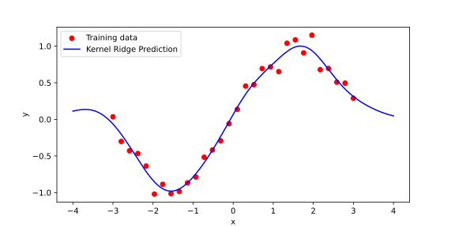
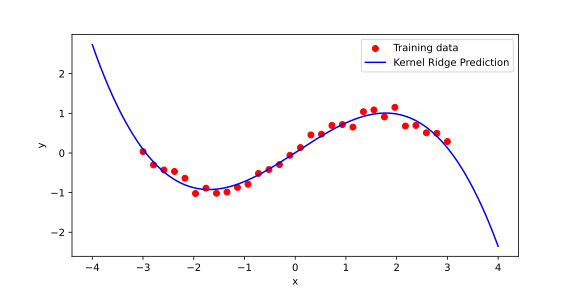
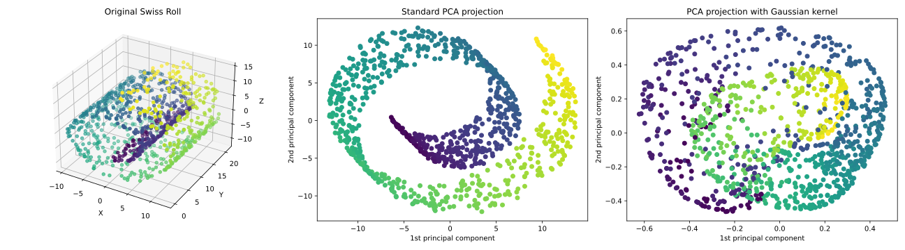
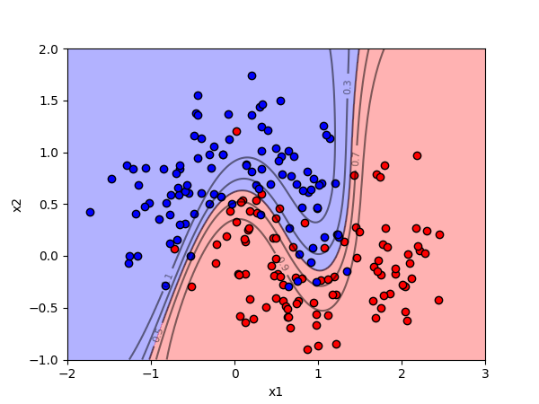

# Kernel Methods – Algorithms and Applications

In the previous chapter, we introduced support vector machines (SVMs) and the idea of kernels, which let us compute inner products in high-dimensional feature spaces without explicitly transforming the data. We saw how this kernel trick enables SVMs to find nonlinear decision boundaries by replacing dot products with kernel functions, leading to powerful yet efficient models.

In this chapter, we move beyond the foundations. We explore how other algorithms—such as ridge regression and principal component analysis—can also be kernelized, opening new possibilities for regression, dimensionality reduction, and clustering. Along the way, we discuss how to choose and combine kernels, approximate them for scalability, and apply kernel methods to real-world problems. Our goal is to show how the simple idea of a kernel can lead to an entire family of flexible and practical machine learning tools.

## Kernel Ridge Regression

In the previous chapter, we have seen how kernels allow us to replace dot products with more flexible measures of similarity, enabling linear algorithms to operate in rich, often infinite-dimensional feature spaces. In this section, we extend another classic linear model—ridge regression—into the kernelized setting. Ridge regression is one of the simplest and most widely used techniques for fitting a function to data while controlling overfitting through regularization. Kernel ridge regression combines the strengths of ridge regression with the flexibility of kernels, resulting in a powerful tool that can model highly nonlinear patterns while remaining mathematically elegant and computationally tractable.

Let us first briefly recall the idea of standard ridge regression. Suppose we are given training data \( (x_i, y_i) \) for \( i = 1, \dots, n \), where \( x_i \in \mathbb{R}^d \) and \( y_i \in \mathbb{R} \). In linear regression, we seek a weight vector \( w \in \mathbb{R}^d \) such that the predicted value \( \hat{y}_i = w^\top x_i \) is as close as possible to the true target \( y_i \). The simplest approach minimizes the sum of squared errors:

\[
\min_w \sum_{i=1}^n (y_i - w^\top x_i)^2.
\]

However, when the number of features is large compared to the number of data points, or when the features are highly correlated, this least squares problem can lead to overfitting or unstable solutions. Ridge regression addresses this by adding a penalty on the size of the weight vector, leading to the optimization problem:

\[
\min_w \sum_{i=1}^n (y_i - w^\top x_i)^2 + \lambda \|w\|^2,
\]

where \( \lambda > 0 \) is a regularization parameter that controls the trade-off between fitting the data and keeping \( w \) small. The closed-form solution for \( w \) is well known and given by:

\[
w = (X^\top X + \lambda I)^{-1} X^\top y,
\]

where \( X \) is the \( n \times d \) matrix whose rows are the \( x_i^\top \), and \( y \) is the vector of targets.

While ridge regression is effective when the relationship between \( x \) and \( y \) is close to linear, it struggles with complex, nonlinear patterns. To address this, we could try to manually design nonlinear features, but a far more systematic approach is to use kernels. Instead of fitting a linear model in the original input space, we will fit a linear model in a high-dimensional feature space where the inputs have been transformed via a (possibly implicit) mapping \( \phi(x) \).

In the kernelized setting, we no longer seek a weight vector \( w \) directly. Instead, by the Representer Theorem, we know that the solution can be expressed as a linear combination of the training examples mapped into feature space:

\[
w = \sum_{i=1}^n \alpha_i \phi(x_i),
\]

where \( \alpha_i \) are coefficients to be determined. Thus, the predicted output for a new point \( x \) becomes:

\[
f(x) = w^\top \phi(x) = \sum_{i=1}^n \alpha_i \langle \phi(x_i), \phi(x) \rangle = \sum_{i=1}^n \alpha_i K(x_i, x),
\]

where \( K(x_i, x) \) is the kernel function that computes the inner product between \( \phi(x_i) \) and \( \phi(x) \). Thus, even though the feature space might be infinite-dimensional, the solution depends only on the finite set of training points, and all computations can be carried out via the kernel function without explicitly constructing the feature mapping.

Our goal is now to determine the coefficients \( \alpha = (\alpha_1, \dots, \alpha_n)^\top \). To find them, we substitute this form into the ridge regression objective. The empirical error term becomes:

\[
\sum_{i=1}^n (y_i - f(x_i))^2 = \sum_{i=1}^n \left(y_i - \sum_{j=1}^n \alpha_j K(x_j, x_i)\right)^2.
\]

The regularization term, originally \( \|w\|^2 \), now becomes:

\[
\|w\|^2 = \left\|\sum_{i=1}^n \alpha_i \phi(x_i)\right\|^2 = \sum_{i,j} \alpha_i \alpha_j \langle \phi(x_i), \phi(x_j) \rangle = \sum_{i,j} \alpha_i \alpha_j K(x_i, x_j).
\]

Thus, the kernel ridge regression objective is:

\[
\min_\alpha \sum_{i=1}^n \left(y_i - \sum_{j=1}^n \alpha_j K(x_j, x_i)\right)^2 + \lambda \sum_{i,j} \alpha_i \alpha_j K(x_i, x_j).
\]

This expression can be written more compactly in matrix notation. Let \( K \) denote the \( n \times n \) Gram matrix with entries \( K_{ij} = K(x_i, x_j) \). Let \( y \) and \( \alpha \) be the column vectors of the targets and coefficients, respectively. Then, the objective becomes:

\[
\min_\alpha (y - K \alpha)^\top (y - K \alpha) + \lambda \alpha^\top K \alpha.
\]

Expanding the terms, we have:

\[
(y - K\alpha)^\top (y - K\alpha) = y^\top y - 2\alpha^\top K y + \alpha^\top K^\top K \alpha,
\]

and thus the full objective is:

\[
y^\top y - 2\alpha^\top K y + \alpha^\top (K^2 + \lambda K) \alpha.
\]

To minimize with respect to \( \alpha \), we take the derivative and set it to zero:

\[
-2Ky + 2(K^2 + \lambda K)\alpha = 0,
\]

which simplifies to:

\[
(K^2 + \lambda K)\alpha = Ky.
\]

Multiplying both sides by \( K^{-1} \) (assuming \( K \) is invertible or adding a small regularization if necessary), we obtain:

\[
(K + \lambda I)\alpha = y,
\]

and thus the closed-form solution:

\[
\alpha = (K + \lambda I)^{-1} y.
\]

This remarkably simple formula shows that, once we have the Gram matrix \( K \), solving for \( \alpha \) requires only solving a linear system, exactly as in standard ridge regression but operating in the space of kernels. Once \( \alpha \) is found, predictions on a new point \( x \) are made by evaluating:

\[
f(x) = \sum_{i=1}^n \alpha_i K(x_i, x).
\]

Kernel ridge regression thus provides a flexible and efficient way to fit nonlinear functions. It retains the computational simplicity of linear models—closed-form solution, no iterative optimization needed—while being capable of modeling highly complex relationships thanks to the choice of the kernel.

To illustrate the utility of kernel ridge regression, consider the following data set:

```python
np.random.seed(0)
X = np.linspace(-3, 3, 30)[:, None]
y = np.sin(X).ravel() + 0.1 * np.random.randn(30)
```

Obviously, the relation between input feature and a class is non-linear. We will use a Gaussian (RBF) kernel that we have already defined in the previous chapter, compute the Gram matrix, and solve for `alpha`:

```python
K = rbf_kernel(X, X, gamma=1.0)
lmbda = 0.1  # regularization strength
n = K.shape[0]
alpha = np.linalg.solve(K + lmbda * np.eye(n), y)
```

To plot a result we can create linearly-spaced input points and compute predictions:

```python
X_test = np.linspace(-4, 4, 200)[:, None]
K_test = rbf_kernel(X_test, X)
y_pred = np.dot(K_test, alpha)
```


**Figure:** Data modelling with kernel ridge regression, where we have used a RBF kernel.

Changing a kernel to polynomial, third-degree kernel, yields a smoother solution:

```python
def polynomial_kernel(X1, X2, degree=3, coef0=1):
    # Polynomial kernel
    return (np.dot(X1, X2.T) + coef0) ** degree
```


**Figure:** Data modelling with kernel ridge regression, where we have used a 3-rd degree polynomial kernel.

# Kernel Principal Component Analysis

Principal Component Analysis (PCA) is one of the most fundamental techniques in machine learning and data analysis. In its classical form, PCA seeks directions in the data that maximize variance. By projecting the data onto these directions, we can reduce its dimensionality while preserving as much of the original structure as possible. However, linear PCA assumes that the important patterns in the data can be captured by linear relationships. This assumption often fails when the data has a complex, non-linear structure. Imagine, for example, points distributed along a twisted "Swiss roll" in three dimensions: no straight line can fully capture the variations inherent in the data. In such cases, linear PCA can only offer a poor approximation.

Kernel PCA extends the ideas of PCA to non-linear structures by using the kernel trick. Instead of working directly with the original data, we implicitly map the data points into a high-dimensional feature space using a non-linear mapping \( \phi(x) \). In this feature space, the complex structure of the data may become simple and linear, allowing standard PCA techniques to uncover meaningful patterns. Crucially, we never need to compute \( \phi(x) \) explicitly. By using a kernel function that calculates inner products in the feature space, we perform all necessary computations efficiently without ever leaving the original input space.

To understand how Kernel PCA works, let us briefly revisit the core steps of linear PCA. Given a data matrix \( X \) with \( n \) samples, each a vector in \( \mathbb{R}^d \), PCA computes the covariance matrix \( \Sigma = \frac{1}{n} X^\top X \) and finds its eigenvectors and eigenvalues. The eigenvectors corresponding to the largest eigenvalues define the principal components: the directions of maximum variance. To project a new point onto these directions, we simply take dot products with the principal eigenvectors.

In Kernel PCA, the idea is the same, but performed in feature space. We want to find directions \( v \) in feature space that maximize the variance of the data after projection. Since the feature space might be very high-dimensional, or even infinite-dimensional, we avoid working with vectors like \( v \) directly. Instead, we seek solutions that can be expressed as linear combinations of the mapped data points, \( v = \sum_{i=1}^n \alpha_i \phi(x_i) \), a fact guaranteed by the Representer Theorem. The optimization problem then reduces to finding the coefficients \( \alpha_i \) that solve a certain eigenvalue problem involving the kernel matrix.

Mathematically, we begin by forming the kernel matrix \( K \), where each entry is \( K_{ij} = K(x_i, x_j) \). This entry represents the inner product between the mapped points \( \phi(x_i) \) and \( \phi(x_j) \) in the feature space: \( K(x_i, x_j) = \langle \phi(x_i), \phi(x_j) \rangle \). Even though we never compute \( \phi(x) \) explicitly, the kernel matrix \( K \) gives us all the information we need to work with the data in the higher-dimensional space. However, before we can perform principal component analysis, we need to make sure that the data is centered in the feature space — that is, that the mean of the mapped data points is zero. This requirement is inherited from standard PCA, where variance is always measured with respect to the mean.

In linear PCA, centering the data is easy: we simply subtract the mean vector from each data point. In kernel PCA, we cannot directly subtract means because we do not have access to the mapped points \( \phi(x_i) \). Instead, we must adjust the kernel matrix itself to behave as if the data were centered. 

To understand how centering affects the kernel matrix, suppose that the mean of the mapped data is:

\[
\bar{\phi} = \frac{1}{n} \sum_{i=1}^n \phi(x_i).
\]

The centered version of \( \phi(x_i) \) is:

\[
\phi(x_i) - \bar{\phi}.
\]

The inner product between two centered points \( \phi(x_i) - \bar{\phi} \) and \( \phi(x_j) - \bar{\phi} \) is then:

\[
\langle \phi(x_i) - \bar{\phi}, \phi(x_j) - \bar{\phi} \rangle.
\]

Expanding this expression using basic properties of the inner product gives:

\[
\langle \phi(x_i), \phi(x_j) \rangle - \langle \phi(x_i), \bar{\phi} \rangle - \langle \bar{\phi}, \phi(x_j) \rangle + \langle \bar{\phi}, \bar{\phi} \rangle.
\]

Each of these terms can be expressed in terms of the original kernel function. The first term \( \langle \phi(x_i), \phi(x_j) \rangle \) is simply \( K(x_i, x_j) \). The second term \( \langle \phi(x_i), \bar{\phi} \rangle \) is the average of \( \langle \phi(x_i), \phi(x_k) \rangle \) over all \( k \), which is:

\[
\langle \phi(x_i), \bar{\phi} \rangle = \frac{1}{n} \sum_{k=1}^n \langle \phi(x_i), \phi(x_k) \rangle = \frac{1}{n} \sum_{k=1}^n K(x_i, x_k).
\]

Similarly, the third term \( \langle \bar{\phi}, \phi(x_j) \rangle \) is:

\[
\frac{1}{n} \sum_{k=1}^n K(x_k, x_j),
\]

and the last term \( \langle \bar{\phi}, \bar{\phi} \rangle \) is the average of all pairwise kernel evaluations:

\[
\langle \bar{\phi}, \bar{\phi} \rangle = \frac{1}{n^2} \sum_{k=1}^n \sum_{l=1}^n K(x_k, x_l).
\]

Putting all this together, the centered kernel matrix \( \tilde{K} \) has entries:

\[
\tilde{K}_{ij} = K(x_i, x_j) - \frac{1}{n} \sum_{k=1}^n K(x_i, x_k) - \frac{1}{n} \sum_{k=1}^n K(x_k, x_j) + \frac{1}{n^2} \sum_{k=1}^n \sum_{l=1}^n K(x_k, x_l).
\]

This formula can be compactly written in matrix form:

\[
\tilde{K} = K - \mathbf{1}_n K - K \mathbf{1}_n + \mathbf{1}_n K \mathbf{1}_n,
\]

where \( \mathbf{1}_n \) is the \( n \times n \) matrix with all entries equal to \( \frac{1}{n} \).  
This compact form efficiently computes the centered kernel matrix without explicit loops over individual entries.

Once we have the centered kernel matrix \( \tilde{K} \), Kernel PCA proceeds exactly like linear PCA. We solve the eigenvalue problem:

\[
\tilde{K} \alpha = \lambda \alpha,
\]

where \( \lambda \) is an eigenvalue and \( \alpha \) is the corresponding eigenvector. This step mirrors what we do in linear PCA, where we compute eigenvectors of the empirical covariance matrix of the data. In Kernel PCA, however, we do not have direct access to the mapped data points \( \phi(x_i) \), so we cannot compute the covariance matrix in feature space explicitly. Instead, it can be shown that the centered kernel matrix \( \tilde{K} \) plays the role of the covariance matrix in the feature space. More precisely, \( \tilde{K} \) is proportional to the Gram matrix of centered feature vectors, and solving the eigenvalue problem on \( \tilde{K} \) allows us to find the directions of maximum variance without ever needing to compute or store the mapped features themselves. Thus, the kernel matrix effectively replaces the covariance matrix in Kernel PCA.

Finally, to project a new point \( x \) onto the \( k \)-th principal component, we need to compute the inner product between \( \phi(x) \) (the feature space mapping of \( x \)) and the corresponding principal component direction. In feature space, this principal component is expressed as:

\[
v^{(k)} = \sum_{i=1}^n \alpha_i^{(k)} \left( \phi(x_i) - \bar{\phi} \right),
\]

where \( \bar{\phi} = \frac{1}{n} \sum_{i=1}^n \phi(x_i) \) is the mean of the mapped training points.

Thus, the projection is:

\[
\text{projection} = \langle \phi(x) - \bar{\phi}, v^{(k)} \rangle.
\]

Expanding this expression:

\[
\text{projection} = \left\langle \phi(x) - \bar{\phi}, \sum_{i=1}^n \alpha_i^{(k)} (\phi(x_i) - \bar{\phi}) \right\rangle = \sum_{i=1}^n \alpha_i^{(k)} \langle \phi(x) - \bar{\phi}, \phi(x_i) - \bar{\phi} \rangle.
\]

Therefore, we need to compute inner products of the form \( \langle \phi(x) - \bar{\phi}, \phi(x_i) - \bar{\phi} \rangle \). Expanding this further:

\[
\langle \phi(x) - \bar{\phi}, \phi(x_i) - \bar{\phi} \rangle = \langle \phi(x), \phi(x_i) \rangle - \langle \phi(x), \bar{\phi} \rangle - \langle \bar{\phi}, \phi(x_i) \rangle + \langle \bar{\phi}, \bar{\phi} \rangle.
\]

Each of these terms can be expressed in terms of the kernel function:

- \( \langle \phi(x), \phi(x_i) \rangle = K(x, x_i) \),
- \( \langle \phi(x), \bar{\phi} \rangle = \frac{1}{n} \sum_{j=1}^n K(x, x_j) \),
- \( \langle \bar{\phi}, \phi(x_i) \rangle = \frac{1}{n} \sum_{j=1}^n K(x_j, x_i) \),
- \( \langle \bar{\phi}, \bar{\phi} \rangle = \frac{1}{n^2} \sum_{j,k=1}^n K(x_j, x_k) \).

Thus, the centered kernel between \( x \) and \( x_i \), denoted \( \tilde{K}(x, x_i) \), is:

\[
\tilde{K}(x, x_i) = K(x, x_i) - \frac{1}{n} \sum_{j=1}^n K(x, x_j) - \frac{1}{n} \sum_{j=1}^n K(x_j, x_i) + \frac{1}{n^2} \sum_{j,k=1}^n K(x_j, x_k).
\]

Finally, the projection of \( x \) onto the \( k \)-th principal component is:

\[
\text{projection}_k(x) = \sum_{i=1}^n \alpha_i^{(k)} \tilde{K}(x, x_i).
\]

This formula shows that to project a new point \( x \), we:

1. Compute its (uncentered) kernel similarities to all training points: \( (K(x_1, x), \ldots, K(x_n, x)) \),
2. Apply the same centering adjustments as we did for the training data,
3. Take the dot product with the corresponding eigenvector \( \alpha^{(k)} \).

This way, we can compute projections purely using kernel evaluations, without ever explicitly mapping into feature space.

In practice, Kernel PCA unlocks the ability to "unfold" complex structures that would be impossible to separate using linear techniques. A classical demonstration is applying Kernel PCA to the "Swiss roll" dataset. In the original three-dimensional space, the data is coiled like a rolled-up sheet. Applying Kernel PCA with a radial basis function (RBF) kernel maps the data into a lower-dimensional space where the intrinsic two-dimensional nature of the data becomes visible and linear. Similarly, the "two moons" dataset, with its interleaving crescent shapes, can be flattened and separated by Kernel PCA, where linear PCA would fail.

Implementing Kernel PCA is remarkably simple once the kernel matrix is constructed. We compute the kernel matrix, center it, perform eigen-decomposition, and project onto the leading eigenvectors. All heavy lifting is handled by basic linear algebra operations, and the choice of kernel function shapes how the non-linear structure is revealed. Polynomial kernels, RBF kernels, and even custom-designed kernels can be used, depending on the nature of the data.

Kernel PCA elegantly shows how the kernel trick extends beyond supervised learning. By working purely with inner products, it allows classic algorithms like PCA to operate in vastly richer spaces. The method reveals the deep idea underlying kernel methods: transforming a problem from one space where it is hard to another space where it is simple, without ever computing the transformation explicitly.

Time for an example in Python. We first generate the data, define the Kernel, and compute the Gram matrix, and center it:

```python
X, color = make_swiss_roll(n_samples=1000, noise=0.05, random_state=42)

def rbf_kernel(X, gamma=0.02):
    sq_dists = np.sum(X**2, axis=1).reshape(-1, 1) + np.sum(X**2, axis=1) - 2 * np.dot(X, X.T)
    return np.exp(-gamma * sq_dists)

K = rbf_kernel(X)

n = K.shape[0]
one_n = np.ones((n, n)) / n
K_centered = K - one_n @ K - K @ one_n + one_n @ K @ one_n
```

Next, we compute the principal components:

```python
eigenvalues, eigenvectors = np.linalg.eigh(K_centered)
idx = np.argsort(eigenvalues)[::-1]
eigenvalues = eigenvalues[idx]
eigenvectors = eigenvectors[:, idx]

# Normalize eigenvectors (important because in feature space, eigenvectors need normalization)
alphas = eigenvectors / np.sqrt(eigenvalues[np.newaxis, :])
```

Following projects the data to principal components:
```python
X_kpca = K_centered @ alphas[:, :2]
```

Following are the results. 


**Figure**: The use of a Gaussian (RBF) kernel is crucial for successfully unfolding the Swiss roll. Because the data lies on a nonlinear manifold, points that are nearby along the roll can be far apart in the ambient three-dimensional space. Linear PCA, which only captures global linear directions, fails to reveal the true structure (the points that span the Y direction are squeezed in the same space). In contrast, the Gaussian kernel captures local similarities by measuring distances in a way that respects the manifold's curvature. Kernel PCA with the RBF kernel thus successfully flattens the Swiss roll, revealing its intrinsic two-dimensional organization.

## Kernel Logistic Regression

We can also kernalize logistic regression. Kernalizing this model may have benefits compared to SVM, as logistic regression nicely models class probabilities and does not focus only on crisp classification. Standard logistic regression models class probability as:

\[
P(y = 1 \mid \mathbf{x}) = \sigma(\mathbf{w}^\top \mathbf{x} + b)
\]

where \(\mathbf{w}\) is a weight vector and \(\mathbf{x}\) is the input. Instead of expressing \(\mathbf{w}\) directly, we express it as a linear combination of training instances:

\[
\mathbf{w} = \sum_{i=1}^n \alpha_i \mathbf{x}_i
\]

where \(\alpha_i\) are coefficients, and \(\mathbf{x}_i\) are the training examples.

Substituting into the original logistic regression formula:

\[
\mathbf{w}^\top \mathbf{x} = \left( \sum_{i=1}^n \alpha_i \mathbf{x}_i \right)^\top \mathbf{x} = \sum_{i=1}^n \alpha_i \mathbf{x}_i^\top \mathbf{x}
\]

Thus, the model becomes:

\[
P(y = 1 \mid \mathbf{x}) = \sigma\left(\sum_{i=1}^n \alpha_i \mathbf{x}_i^\top \mathbf{x} + b\right)
\]

Finally, to **kernelize**, we replace each inner product \(\mathbf{x}_i^\top \mathbf{x}\) with a **kernel function** \(K(\mathbf{x}_i, \mathbf{x})\), giving:

\[
P(y = 1 \mid \mathbf{x}) = \sigma\left(\sum_{i=1}^n \alpha_i K(\mathbf{x}_i, \mathbf{x}) + b\right)
\]

Here is the code for kernalized logistic regression. We first define the data, introduce a kernel (we opted for a Gaussian kernel) and compute the Gram matrix:

```python
X, y = make_moons(n_samples=200, noise=0.3, random_state=42)

def rbf_kernel(X1, X2, gamma=0.5):
    dists = np.sum(X1**2, axis=1)[:, None] + np.sum(X2**2, axis=1)[None, :] - 2 * X1 @ X2.T
    return np.exp(-gamma * dists)

gamma = 0.5
K = rbf_kernel(X, X, gamma)
```

Next, we define the loss function for the logistic regression. The loss is based on the standard log likelihood for logistic regression, that is, a cross-entropy loss:

```python
def sigmoid(z):
    return 1 / (1 + np.exp(-z))

def logistic_loss(alpha):
    pred = sigmoid(K @ alpha)
    return -np.mean(y * np.log(pred + 1e-15) + (1 - y) * np.log(1 - pred + 1e-15))
```

Optimization step is next:

```python
result = minimize(logistic_loss, np.zeros(X.shape[0]), method='L-BFGS-B')
alpha = result.x
```

The result is depicted in the following graph. 


**Figure:** Kernelized logistic regression, showing the decision boundary and probability contours for the target class (in red).

### Kernel k-means

Kernel methods are not limited to supervised learning. We have already shown that in our example for kernel PCA. Another important example in unsupervised learning is kernel k-means, which generalizes the standard k-means clustering algorithm to allow for discovering more complex cluster shapes.

Standard k-means partitions data by assigning each point \(\mathbf{x}_i\) to the nearest cluster center \(\boldsymbol{\mu}_k\), minimizing the squared Euclidean distance:

\[
\text{assign } \mathbf{x}_i \text{ to cluster } k = \arg \min_k \|\mathbf{x}_i - \boldsymbol{\mu}_k\|^2
\]

While k-means does not require linear separation between clusters, it tends to perform well only when clusters are roughly spherical, compact, and equally sized — such as concentric or well-separated blobs. It struggles with more complex, non-convex cluster shapes.

Kernel k-means addresses this limitation by implicitly mapping the data into a higher-dimensional feature space using a mapping \(\phi(\mathbf{x})\), where more complex structures can become easier to separate. The algorithm then minimizes distances in the feature space:

\[
\text{assign } \mathbf{x}_i \text{ to cluster } k = \arg \min_k \|\phi(\mathbf{x}_i) - \boldsymbol{\mu}_k'\|^2
\]

where \(\boldsymbol{\mu}_k'\) is the mean of cluster \(k\) in the feature space.

Expanding the squared distance gives:

\[
\|\phi(\mathbf{x}_i) - \boldsymbol{\mu}_k'\|^2 = K(\mathbf{x}_i, \mathbf{x}_i) - \frac{2}{|C_k|} \sum_{\mathbf{x}_j \in C_k} K(\mathbf{x}_i, \mathbf{x}_j) + \frac{1}{|C_k|^2} \sum_{\mathbf{x}_j, \mathbf{x}_l \in C_k} K(\mathbf{x}_j, \mathbf{x}_l)
\]

where:
- \(K(\mathbf{x}_i, \mathbf{x}_j)\) is the kernel function,
- \(C_k\) is the set of points assigned to cluster \(k\),
- \(|C_k|\) is the number of points in cluster \(k\).

Thus, Kernel k-means proceeds exactly like k-means but replaces Euclidean distances with distances computed via kernels, enabling it to discover non-convex, complex cluster structures. While we will not explore the full algorithm in this lesson, mentioning Kernel k-means illustrates how the kernel trick can extend beyond classification to enable more flexible clustering as well.

## Kernel approximation techniques


Kernel methods enable learning complex relationships without explicit feature transformations, but they often suffer from high computational costs. Computing and storing the full \(n \times n\) kernel matrix becomes expensive for large datasets. To address this, several kernel approximation techniques have been developed that make kernel methods scalable. Two widely used techniques are the Nyström method and Random Fourier Features.

The Nyström method approximates the full kernel matrix by sampling a small subset of the data points. Suppose we select \(m\) representative points (with \(m \ll n\)). We compute two smaller matrices: \(K_{mm}\), the kernel matrix between the sampled points, and \(K_{nm}\), the kernel matrix between all data points and the sampled points. Each entry of \(K_{mm}\) is given by

\[
(K_{mm})_{ij} = K(\mathbf{x}_i, \mathbf{x}_j)
\]

where \(\mathbf{x}_i\) and \(\mathbf{x}_j\) are sampled points, and each entry of \(K_{nm}\) is given by

\[
(K_{nm})_{ij} = K(\mathbf{x}_i, \mathbf{x}_j)
\]

where \(\mathbf{x}_i\) is any data point and \(\mathbf{x}_j\) is a sampled point. The full kernel matrix \(K_{nn}\) is then approximated as

\[
K_{nn} \approx K_{nm} K_{mm}^{-1} K_{nm}^\top
\]

This reduces both storage and computation, enabling approximate kernel methods on much larger datasets.

Random Fourier Features approximate shift-invariant kernels, such as the RBF kernel, by mapping inputs into a randomized finite-dimensional feature space where inner products approximate the kernel. By Bochner’s theorem, a shift-invariant kernel can be expressed as the Fourier transform of a probability distribution. To construct random features, we sample random frequencies \(\omega\) from the Fourier transform of the kernel and define random features

\[
z(\mathbf{x}) = \sqrt{2} \cos(\omega^\top \mathbf{x} + b)
\]

where \(b\) is sampled uniformly from \([0, 2\pi]\). Instead of computing \(K(\mathbf{x}, \mathbf{x'})\), we now compute

\[
K(\mathbf{x}, \mathbf{x'}) \approx z(\mathbf{x})^\top z(\mathbf{x'})
\]

This technique reduces the problem to a simple linear model in the new randomized feature space.

Both the Nyström method and Random Fourier Features allow large-scale learning with kernel methods by approximating the kernel matrix or embedding the data into a lower-dimensional space. They make kernel-based algorithms practical for modern datasets without losing much of the expressive power of kernels.

### Kernel methods in text mining and bioinformatics

Kernel methods are highly flexible and can be adapted to domains where data are not naturally represented as numerical vectors. In areas such as natural language processing (NLP) and bioinformatics, kernel methods enable learning directly from structured objects like strings, sequences, or trees.

In NLP, string kernels measure similarity between two text sequences without explicit feature extraction. For example, the substring kernel counts the number of common subsequences between two strings. Given two strings \(s\) and \(t\), the kernel value is higher if they share many common subsequences, weighted by their lengths and positions. This allows classifiers such as SVMs to operate directly on text, enabling tasks like text classification, document categorization, and named entity recognition without the need for explicit vectorization.

In bioinformatics, kernel methods are used to compare biological sequences such as DNA, RNA, or proteins. A common example is the spectrum kernel, which represents sequences by their counts of all possible \(k\)-mers (substrings of length \(k\)). The spectrum kernel between two sequences \(s\) and \(t\) is defined as

\[
K(s, t) = \langle \Phi_k(s), \Phi_k(t) \rangle
\]

where \(\Phi_k(s)\) is a feature vector counting the occurrences of each possible \(k\)-mer in sequence \(s\). More advanced kernels, such as mismatch kernels and gapped substring kernels, allow for small mutations, making them well-suited to biological data where sequences may not match exactly.

In both NLP and bioinformatics, kernel methods leverage domain-specific similarity functions to apply powerful machine learning techniques directly to structured or discrete data without requiring manual feature engineering.