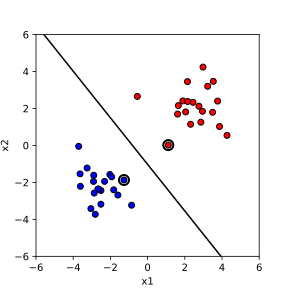

# Kernel Methods – Foundations

Many machine learning models, such as linear classifiers, regressors, even data projections and clustering, work well when the data can be modelled with a straight line or a hyperplane. However, real-world data is often non-linear and not linearly separable. A common strategy to address this is to map the data into a higher-dimensional space where a linear separator may exist. Explicitly computing this transformation can be expensive or infeasible, especially in very high-dimensional spaces, and it may require a lot of memory, particularly when the original data set already contains many features.

A number of machine learning models can be expressed in terms of inner products between data instance vectors, measuring, in a way, a similarity between the data instances. Instead of expanding the vectors into a higher-dimensional feature space and computing inner products there, kernel methods introduce a trick: they use a kernel function that operates in the original input space but computes the inner product as if the data were transformed into the higher-dimensional space. This avoids the need for explicit expansion and reduces computational and memory costs.

SVMs are a natural starting point for understanding kernel methods, but they are just one example of methods that can benefit from kernels. In this lesson, we will see how the same trick applies to other machine learning methods as well. To build this understanding, we begin with the linear SVM.

## Linear SVM: Primal Form

We start with a binary classification problem. Given training examples \( (x_i, y_i) \), where \( x_i \in \mathbb{R}^d \) and \( y_i \in \{-1, 1\} \), we want to find a hyperplane that separates the two classes.

A hyperplane in \( \mathbb{R}^d \) is defined by a weight vector \( w \) and a bias term \( b \). The decision function is:

\[
f(x) = w^\top x + b
\]

A point \( x \) is classified as positive if \( f(x) > 0 \) and negative if \( f(x) < 0 \).

The **primal form** is the original formulation of the optimization problem where we directly solve for \( w \) and \( b \). The goal is to find the hyperplane that not only separates the data but does so with the **largest possible margin**. We call this the **maximum-margin classifier** because we are maximizing the distance between the hyperplane and the closest data points from each class. A larger margin tends to improve generalization.

To simplify the math, we scale \( w \) and \( b \) so that for the support vectors (the closest points), the margin is exactly 1. This leads to the following constraints:

\[
y_i (w^\top x_i + b) \geq 1 \quad \text{for all } i
\]

The equation of the hyperplane is \( w^\top x + b = 0 \). The distance \( d \) from a point \( x \) to the hyperplane is given by:

\[
d = \frac{|w^\top x + b|}{\|w\|}
\]

For the support vectors, which are the points closest to the hyperplane, the constraint \( y_i (w^\top x_i + b) = 1 \) holds. Substituting into the distance formula, the margin \( \gamma \) is:

\[
\gamma = \frac{1}{\|w\|}
\]

Thus, maximizing the margin is the same as minimizing \( \|w\| \). For mathematical convenience, we minimize \( \frac{1}{2} \|w\|^2 \) instead of \( \|w\| \) directly, because it simplifies the derivatives in the optimization. 

Therefore, the optimization problem becomes:

\[
\min_{w, b} \quad \frac{1}{2} \|w\|^2
\]
subject to:
\[
y_i (w^\top x_i + b) \geq 1 \quad \text{for all } i
\]

This is known as the **hard-margin SVM**, which assumes that the data is perfectly linearly separable. That means there exists at least one hyperplane that separates all positive and negative examples without error.

This assumption is often unrealistic in practice. Real-world data is noisy and may not be perfectly separable. In such cases, we use the soft-margin SVM, which allows some violations of the margin constraints by introducing slack variables. Soft-margin SVMs are more flexible and applicable to a wider range of data.

However, in this section, we focus on the hard-margin case because it allows us to introduce the key mathematical ideas behind SVMs more clearly. Most importantly, the dual form of the hard-margin SVM is simpler and provides the foundation for understanding how kernel methods work. The kernel trick is applied in the dual, and introducing it in the hard-margin setting avoids additional complications. We will not cover soft-margin SVMs in detail here, but the kernelization approach we develop extends naturally to that setting as well.

## Deriving the Dual Form

To solve the support vector machine optimization problem, we start with the primal form:

\[
\min_{w, b} \quad \frac{1}{2} \|w\|^2
\]
subject to:
\[
y_i (w^\top x_i + b) \geq 1 \quad \text{for all } i
\]

This is a constrained optimization problem, meaning we want to minimize an objective function while satisfying certain conditions on the variables. To handle the constraints systematically, we introduce Lagrange multipliers \( \alpha_i \geq 0 \) for each constraint. Lagrange multipliers allow us to combine the objective function and the constraints into a single expression called the Lagrangian. By doing so, we transform the constrained optimization problem into an unconstrained one, where we can apply calculus techniques to find optimal solutions. The multipliers \( \alpha_i \) can be interpreted as forces that push against the constraints, helping us balance minimizing the objective with satisfying the conditions. Our Lagrangian is:

\[
L(w, b, \alpha) = \frac{1}{2} \|w\|^2 - \sum_i \alpha_i [y_i (w^\top x_i + b) - 1]
\]

The idea is to minimize \( L \) with respect to the primal variables \( w \) and \( b \), and maximize it with respect to the dual variables \( \alpha_i \). To find the dual, we first compute the partial derivatives of \( L \) with respect to \( w \) and \( b \) and set them to zero:

\[
\frac{\partial L}{\partial w} = w - \sum_i \alpha_i y_i x_i = 0 \quad \Rightarrow \quad w = \sum_i \alpha_i y_i x_i
\]
\[
\frac{\partial L}{\partial b} = -\sum_i \alpha_i y_i = 0
\]

Substituting these expressions back into the Lagrangian eliminates \( w \) and \( b \), resulting in the dual problem:

\[
L(\alpha) = \sum_i \alpha_i - \frac{1}{2} \sum_{i,j} \alpha_i \alpha_j y_i y_j x_i^\top x_j
\]

Thus, the dual optimization problem becomes:

\[
\max_{\alpha} \sum_i \alpha_i - \frac{1}{2} \sum_{i,j} \alpha_i \alpha_j y_i y_j x_i^\top x_j
\]
subject to:
\[
\alpha_i \geq 0, \quad \sum_i \alpha_i y_i = 0
\]

In the dual problem, the optimization depends only on the dot products \( x_i^\top x_j \) between pairs of training examples. To simplify both the notation and the computation, we introduce the **Gram matrix** \( K \), defined by \( K_{ij} = x_i^\top x_j \). The Gram matrix collects all pairwise dot products between training points into a single matrix. It is called a "Gram matrix" because, in linear algebra, such a matrix arises when computing all inner products between a set of vectors, and its properties reflect the geometric relationships—such as angles and lengths—between those vectors. In particular, the Gram matrix is always symmetric and positive semi-definite, properties that are crucial for the convexity and solvability of the dual optimization problem.

The dual form is crucial because it reveals important properties of the solution and simplifies further developments. In the dual, the data points appear only through dot products \( x_i^\top x_j \), which will later allow us to introduce kernels and extend SVMs to non-linear decision boundaries. 

Moreover, solving the dual often results in sparse solutions: most of the \( \alpha_i \) will be zero, and only a small subset of points with \( \alpha_i > 0 \) — the support vectors — will define the decision boundary.

Once we solve for the optimal multipliers \( \alpha_i \), we can reconstruct the weight vector as:

\[
w = \sum_i \alpha_i y_i x_i
\]

The decision function for classifying new points is:

\[
f(x) = \sum_i \alpha_i y_i x_i^\top x + b
\]

The bias term \( b \) can be computed using any support vector. This compact representation shows that only the support vectors are needed for predictions, making the model efficient in both computation and memory.

## Diversion: Quadratic Programming and an Example with `cvxopt`

When solving the dual form of the SVM, we face a specific type of optimization problem known as a quadratic program. Quadratic programming involves minimizing (or maximizing) a quadratic objective function subject to linear constraints. To understand how this works in practice, we first introduce a simple real-world example that shows how quadratic programming problems arise and how they can be solved using Python.

Imagine you are investing money between two assets: stocks and bonds. You want to allocate your investment in a way that minimizes the overall risk. In finance, the risk of an investment is often quantified using the variance or covariance of returns. The idea is that if two assets tend to move together, the overall portfolio is riskier. If they move independently or in opposite directions, the risk is reduced. Mathematically, the total risk of the investment can be expressed as a quadratic function of the investment proportions.

Let \( x = (x_1, x_2) \) represent the fractions of your money invested in stocks and bonds, respectively. The risk is given by the expression:

\[
\text{Risk} = \frac{1}{2} x^\top P x
\]

where \( P \) is the covariance matrix of returns. Each entry of \( P \) has a specific meaning: \( P_{11} \) measures how much stock returns fluctuate on their own (the variance of stocks), \( P_{22} \) measures the variance of bond returns, and \( P_{12} = P_{21} \) measures the covariance between stock and bond returns. A positive covariance means that stocks and bonds tend to move together, while a negative covariance would indicate that they move in opposite directions.

For simplicity, we assume that the covariance matrix is:

\[
P = \begin{bmatrix} 0.1 & 0.05 \\ 0.05 & 0.2 \end{bmatrix}
\]

In this setup, stocks have a variance of 0.1, bonds have a higher variance of 0.2, and their returns are positively correlated with a covariance of 0.05. Your goal is to minimize the risk while investing all of your available money and ensuring that no negative investments are made (no short selling).

The optimization problem can be formally stated as:

\[
\min_{x} \quad \frac{1}{2} x^\top P x
\]
subject to:

\[
x_1 + x_2 = 1, \quad x_1 \geq 0, \quad x_2 \geq 0
\]

This says that the sum of investments must be exactly one (you invest all your money), and each investment must be non-negative.

We can solve this quadratic program using Python and the `cvxopt` library. The `cvxopt` package is designed for convex optimization and can efficiently solve quadratic problems. The following code demonstrates how to set up and solve the problem:

```python
import numpy as np
from cvxopt import matrix, solvers

# Covariance matrix
P = matrix([[0.1, 0.05],
            [0.05, 0.2]])

# No linear term in the objective
q = matrix([0.0, 0.0])

# Constraints: Gx <= h for x1 >= 0, x2 >= 0
G = matrix([[-1.0, 0.0],
             [0.0, -1.0]])
h = matrix([0.0, 0.0])

# Constraint: Ax = b for x1 + x2 = 1
A = matrix([[1.0], [1.0]])   # Note: A must have size (2, 1)
b = matrix([1.0])

# Solve the quadratic program
solution = solvers.qp(P, q, G, h, A, b)

# Extract and display solution
x = np.array(solution['x']).flatten()
print("Optimal portfolio allocation:", x)
```

In the quadratic program we want to solve, each matrix and vector has a specific role that corresponds to part of the mathematical formulation.

The matrix \( P \) represents the quadratic part of the objective function. The objective we are minimizing is

\[
\frac{1}{2} x^\top P x + q^\top x,
\]

where in our case \( q = 0 \), so the objective reduces to minimizing only the quadratic term. In our example, \( P \) is the covariance matrix of asset returns, encoding how much each asset fluctuates on its own (the variances) and how much the two assets fluctuate together (the covariance). The diagonal elements \( P_{11} \) and \( P_{22} \) represent the variance of stocks and bonds, respectively, while the off-diagonal elements \( P_{12} = P_{21} \) represent the covariance between stocks and bonds.

The vector \( q \) represents the linear part of the objective function. Since there is no linear component in the risk function, \( q \) is simply the zero vector.

The matrix \( G \) and the vector \( h \) encode the inequality constraints. Inequality constraints are written as

\[
Gx \leq h,
\]

and in this case, they enforce that the investment fractions \( x_1 \) and \( x_2 \) must be non-negative:

\[
x_1 \geq 0, \quad x_2 \geq 0.
\]

These conditions ensure that no negative investments (no short selling) are allowed.

The matrix \( A \) and the vector \( b \) encode the equality constraints. Equality constraints are written as

\[
Ax = b,
\]

and here they enforce that the entire available amount is invested, meaning:

\[
x_1 + x_2 = 1.
\]

This guarantees that the full investment is allocated between stocks and bonds without any leftover.

When setting up a quadratic program, arranging the problem into the standard form with matrices \( P \), \( q \), \( G \), \( h \), \( A \), and \( b \) is crucial, as solvers like cvxopt expect the input in exactly this structure. This same decomposition will be used in the next section to solve the dual form of the support vector machine.

When we run this code, the solver finds the optimal fractions of money to invest in stocks and bonds to achieve the minimum risk according to the given covariance matrix. 

```python
     pcost       dcost       gap    pres   dres
 0:  4.8915e-02 -9.7278e-01  1e+00  6e-17  2e+00
 1:  4.8045e-02  1.9093e-02  3e-02  1e-16  6e-02
 2:  4.3933e-02  4.1156e-02  3e-03  2e-16  4e-18
 3:  4.3750e-02  4.3676e-02  7e-05  1e-16  1e-17
 4:  4.3750e-02  4.3749e-02  7e-07  1e-16  4e-18
 5:  4.3750e-02  4.3750e-02  7e-09  1e-16  5e-18
Optimal solution found.
Optimal portfolio allocation: [0.74999986 0.25000014]
```

When we run the solver, it outputs information about the optimization process, showing how the primal cost and dual cost converge toward each other, with the gap between them shrinking at each iteration. These diagnostics indicate that the optimization is proceeding correctly. At the end, the solver reports that the optimal solution has been found. The final result shows that approximately 75% of the money should be invested in stocks and 25% in bonds to minimize the overall portfolio risk according to the given covariance matrix.

In convex optimization, the primal cost refers to the value of the original optimization objective, while the dual cost refers to the value of the dual optimization problem, which is mathematically derived from the primal by introducing Lagrange multipliers. For convex problems, strong duality usually holds, meaning that at the optimal solution, the primal and dual costs should be equal. During the optimization process, the solver monitors both the primal and dual costs, and the difference between them, called the duality gap, measures how close the current solution is to optimality. When the primal and dual costs converge and the duality gap becomes very small, the solver concludes that it has found an optimal solution.

## Linear SVM and Quadratic Programming: An Example in Python

We have seen that solving the dual form of a support vector machine leads naturally to a quadratic programming problem.  
Let us now recall the objective and show how it can be solved in practice.

The dual form of the hard-margin SVM optimization problem is:

\[
\max_\alpha \sum_i \alpha_i - \frac{1}{2} \sum_{i,j} \alpha_i \alpha_j y_i y_j x_i^\top x_j
\]
subject to:

\[
\alpha_i \geq 0, \quad \sum_i \alpha_i y_i = 0
\]

The variables \( \alpha_i \) are the Lagrange multipliers associated with each training example.  
Only a few \( \alpha_i \) will be nonzero at the solution, corresponding to the support vectors.

To solve this problem with a quadratic programming solver like `cvxopt`, we need to express it in the standard form:

\[
\min_x \quad \frac{1}{2} x^\top P x + q^\top x
\]
subject to:

\[
Gx \leq h, \quad Ax = b
\]

where the matrices are defined as follows:

- \( P_{ij} = y_i y_j x_i^\top x_j \)
- \( q_i = -1 \) for all \( i \)
- \( G = -I \) and \( h = 0 \), enforcing \( \alpha_i \geq 0 \)
- \( A \) is a row vector of \( y_i \) values
- \( b = 0 \), enforcing \( \sum_i \alpha_i y_i = 0 \)

We now demonstrate how to solve this problem with synthetic linearly separable data in Python.

First, we generate a simple 2D dataset:

```python
import numpy as np
import matplotlib.pyplot as plt
from cvxopt import matrix, solvers

# Generate synthetic data
np.random.seed(0)
num_samples = 20
X_pos = np.random.randn(num_samples, 2) + np.array([2, 2])
X_neg = np.random.randn(num_samples, 2) + np.array([-2, -2])
X = np.vstack((X_pos, X_neg))
y = np.hstack((np.ones(num_samples), -np.ones(num_samples)))
```

Next, we set up the matrices for the quadratic program:

```python
# Compute the Gram matrix
K = np.dot(X, X.T)
P = matrix(np.outer(y, y) * K)
q = matrix(-np.ones(2 * num_samples))
G = matrix(-np.eye(2 * num_samples))
h = matrix(np.zeros(2 * num_samples))
A = matrix(y, (1, 2 * num_samples), 'd')
b = matrix(0.0)
```

We solve the quadratic program:

```python
solution = solvers.qp(P, q, G, h, A, b)
alphas = np.array(solution['x']).flatten()
```

Now, primarily for plotting of our model, we can now find the weight vector \( w \) and bias \( b \), primarily for plotting of the model.

```python
# Reconstruct w
w = np.sum(alphas[:, None] * y[:, None] * X, axis=0)

# Identify support vectors
support_vectors = alphas > 1e-5

# Compute b using any support vector
b_value = np.mean(y[support_vectors] - np.dot(X[support_vectors], w))
```

Since our data lies in two-dimensions, we can now plot it, together with the decision boundary and the support vectors, that is, the data items which lie on the decision margins:



**Figure:** Decision boundary and support vectors for a linear SVM trained via quadratic programming; support vectors are highlighted with larger markers.

Note that for classifying the new data we would not compute the feature weights and the intercept. Instead, Once the optimal \( \alpha_i \) are found, we can classify a new point \( x \) by evaluating the decision function

\[
f(x) = \sum_i \alpha_i y_i K(x_i, x) + b,
\]

where the sum runs over all support vectors (those points with \( \alpha_i > 0 \)). This will especially come handy in the sections that follows, once we move from linear decision boundaries.

In this example, we see how solving the SVM dual problem results in a sparse set of support vectors, which define the decision boundary. The data points corresponding to nonzero \( \alpha_i \) are exactly those lying on the margin, and they are highlighted in the plot.  
This simple demonstration shows both the practical use of quadratic programming and the intuitive structure of the SVM solution.

## Soft Margin Linear SVM

In practice, real-world data is often noisy or overlapping, and perfect linear separability is not possible. If we apply a hard-margin SVM to such data, the optimization problem may have no solution at all. To handle this, the soft-margin SVM was introduced, allowing some points to violate the margin constraints while still aiming to find a hyperplane that separates the data as well as possible.

The idea is to introduce slack variables \( \xi_i \geq 0 \) that measure how much each point violates the margin. The primal optimization problem for the soft-margin SVM becomes:

\[
\min_{w, b, \xi} \quad \frac{1}{2} \|w\|^2 + C \sum_i \xi_i
\]
subject to:

\[
y_i (w^\top x_i + b) \geq 1 - \xi_i, \quad \xi_i \geq 0 \quad \text{for all } i
\]

Here, \( C > 0 \) is a regularization parameter that controls the trade-off between maximizing the margin and minimizing the total amount of margin violation.

In the dual form, the only change compared to the hard-margin case is in the inequality constraint on \( \alpha_i \). While for the hard-margin case we required only \( \alpha_i \geq 0 \), the soft-margin dual constraints become:

\[
0 \leq \alpha_i \leq C
\]

This means that now each \( \alpha_i \) is bounded above by \( C \). Let us describe how we came to this constraint. In the hard-margin SVM, we required that the training points be separated perfectly. This led to constraints \( y_i (w^\top x_i + b) \geq 1 \) for all \( i \), and in the dual, the condition on the Lagrange multipliers was simply \( \alpha_i \geq 0 \).

In the soft-margin SVM, we allow violations of the margin by introducing slack variables \( \xi_i \geq 0 \), and the constraint becomes:

\[
y_i (w^\top x_i + b) \geq 1 - \xi_i
\]

To penalize violations, the primal objective function adds a term \( C \sum_i \xi_i \), where \( C > 0 \) controls the strength of the penalty.  

When we set up the Lagrangian for this problem, we introduce:
- \( \alpha_i \geq 0 \) for the margin constraint,
- \( \mu_i \geq 0 \) for the slack variable constraint \( \xi_i \geq 0 \).

The full Lagrangian becomes:

\[
L(w, b, \xi, \alpha, \mu) = \frac{1}{2} \|w\|^2 + C \sum_i \xi_i - \sum_i \alpha_i [y_i(w^\top x_i + b) - 1 + \xi_i] - \sum_i \mu_i \xi_i
\]

Now, take the derivative of \( L \) with respect to \( \xi_i \) and set it to zero:

\[
\frac{\partial L}{\partial \xi_i} = C - \alpha_i - \mu_i = 0
\]

Since \( \mu_i \geq 0 \) and from this equation \( \alpha_i + \mu_i = C \), it follows that:

\[
\alpha_i \leq C
\]

Thus, each \( \alpha_i \) must satisfy both \( \alpha_i \geq 0 \) and \( \alpha_i \leq C \), which together gives:

\[
0 \leq \alpha_i \leq C
\]

This is how the constraint in the dual form changes from the hard-margin to the soft-margin SVM. The upper bound \( C \) appears because we explicitly allow controlled margin violations in the primal.

Therefore, to modify the code for the soft-margin SVM, we only need to change the matrix \( G \) and the vector \( h \) to reflect both lower and upper bounds:

```python
# For soft-margin SVM: enforce 0 <= alpha_i <= C
C_value = 1.0  # Example value of C

# Stack two constraints: -alpha <= 0 and alpha <= C
G = matrix(np.vstack((-np.eye(2 * num_samples), np.eye(2 * num_samples))))
h = matrix(np.hstack((np.zeros(2 * num_samples), C_value * np.ones(2 * num_samples))))
```

All other parts of the code remain exactly the same. By adjusting the value of \( C \), we can control how strictly we penalize margin violations: large values of \( C \) make the SVM behave like a hard-margin SVM, while smaller values allow for more flexibility and better handling of noisy data. A typical value of \( C \) is between 0.1 and 100, depending on the scale and noise of the data.  

- If \( C \) is large (e.g., \( C = 1000 \)), the SVM will strongly penalize misclassifications, behaving almost like a hard-margin SVM.
- If \( C \) is small (e.g., \( C = 0.1 \)), the SVM will allow more violations, leading to a wider margin that tolerates some errors.

In practice, \( C \) is often selected using internal cross-validation to find the value that gives the best generalization on unseen data.

We used the above code, changed the data slightly to introduce overlap of classes, and obtain the following solution:


## Beyond Linearity in SVM: The Kernel Trick

So far, we have seen how a linear SVM can find a separating hyperplane for linearly separable or almost linearly separable data. However, many real-world datasets are not linearly separable in the original input space. To illustrate this, let us consider a simple example: the "moons" dataset, a classic toy dataset where two classes form crescent shapes. This data cannot be separated by any straight line.

```python
from sklearn.datasets import make_moons

# Generate non-linearly separable data
X, y = make_moons(n_samples=100, noise=0.1, random_state=0)
y = 2 * y - 1  # Convert labels from {0,1} to {-1,1}
```


**Figure:** Two-dimensional data with non-linear classification boundary and overlap between the two classes.

If we attempt to apply a linear SVM to this dataset, the results will be poor, as no linear hyperplane can effectively separate the two classes. This motivates the use of kernels, which offer a powerful way to extend linear models to non-linear settings.

The key observation is that in the dual formulation of the SVM, the data appears only through dot products \( x_i^\top x_j \). The kernel trick is the idea that we can replace these dot products with a kernel function \( K(x_i, x_j) \), where the function computes the inner product between \( \phi(x_i) \) and \( \phi(x_j) \) in some higher-dimensional feature space. Crucially, we do not need to compute the mapping \( \phi(x) \) explicitly. We only need a kernel function that gives the correct inner product in the transformed space.

Since the dual SVM depends only on dot products, replacing them with a kernel function modifies the decision function accordingly. In the kernelized SVM, the **decision function** used to classify a new point \( x \) becomes:

\[
f(x) = \sum_i \alpha_i y_i K(x_i, x) + b
\]

where the sum runs over all support vectors (the points with \( \alpha_i > 0 \)). This form shows how the kernel allows us to operate in a high-dimensional feature space without ever explicitly computing the mapping.

One intuitive and simple choice of kernel is the polynomial kernel, defined by

\[
K(x, x') = (x^\top x' + c)^d,
\]

where \( d \) is the degree of the polynomial and \( c \) is a constant controlling the influence of higher-order terms. In our implementation, using a kernel instead of the plain dot product requires only a small change: when computing the Gram matrix, instead of using \( K_{ij} = x_i^\top x_j \), we compute \( K(x_i, x_j) \) using the chosen kernel function.

For the polynomial kernel, the Gram matrix is computed as:

```python
# Polynomial kernel function
def polynomial_kernel(X, degree=3, coef0=1):
    return (np.dot(X, X.T) + coef0) ** degree

# Compute the kernel matrix
K = polynomial_kernel(X, degree=3, coef0=1)
P = matrix(np.outer(y, y) * K)
```

For implementation of SVM, all the other parts of the code—setting up \( q \), \( G \), \( h \), \( A \), \( b \), solving the quadratic program, and identifying support vectors—remain exactly the same as before. The only difference lies in how we compute the inner products between data points: instead of using the standard dot product, we replace it with the value given by the chosen kernel function.

The followig figure shows the result of our procedure.


**Figure:** Decision boundary and margins for SVM with polynomial kernel with degree 3. To plot this figure, a dense grid of points is generated across the feature space, and the decision function is evaluated at each point. The decision boundary and margins are drawn as contour lines corresponding to \( f(x) = 0 \) (the boundary) and \( f(x) = \pm 1 \) (the margins). The support vectors are highlighted with larger circles to emphasize the points that define the structure of the classifier.

By applying the kernel trick, we can now find flexible, non-linear decision boundaries in the original input space. This enables SVMs to handle complex data patterns without changing the core structure of the algorithm.

Intuitively, the kernel function acts as a measure of similarity between two data points, but not in the original input space. Instead, it measures how similar the points are after an implicit mapping into a higher-dimensional feature space. Two points \( x \) and \( x' \) are considered similar if \( K(x, x') \) is large, and dissimilar if \( K(x, x') \) is small. In the case of the standard linear kernel, this similarity reduces to the ordinary dot product \( x^\top x' \). With more complex kernels, such as the polynomial kernel

\[
K(x, x') = (x^\top x' + c)^d,
\]

the notion of similarity becomes richer, capturing not just the direct alignment of two vectors, but also higher-order interactions between their components.

This interpretation helps explain how the SVM can separate non-linearly distributed classes. Instead of relying on the geometric arrangement of points in the original input space, it relies on the similarities encoded by the kernel function. The optimization problem then seeks a decision boundary that separates points that are similar in one way from points that are similar in another, according to the kernel-induced geometry.

## Why Calling It a Trick?

The term "kernel trick" is used because it allows us to achieve a powerful transformation without explicitly performing any complicated or costly computations. In principle, mapping the data points \( x \) into a high-dimensional or even infinite-dimensional feature space via a function \( \phi(x) \) could be computationally infeasible. However, by using a kernel function \( K(x, x') \), we can compute the inner products between transformed points directly, without ever constructing \( \phi(x) \) itself.

The "trick" is that the algorithm operates as if it were working in a high-dimensional space, benefiting from the increased expressive power, while remaining computationally efficient and mathematically simple. The structure of the SVM optimization problem does not change; only the way we compute similarities between data points is modified through the kernel function. This elegant shortcut is what gives the kernel trick its name.

## Common Kernels

Once we understand the kernel trick, it is natural to ask which kernel function we should choose for a particular problem. Several kernels have become standard tools, each suited to different types of data and problem settings.

The **linear kernel** is the simplest kernel, given by

\[
K(x, x') = x^\top x'.
\]

It corresponds to the standard dot product in the original space and leads to a linear decision boundary. It is a good choice when the data is already approximately linearly separable or when the number of features is very large compared to the number of samples.

The **polynomial kernel** is given by

\[
K(x, x') = (x^\top x' + c)^d,
\]

where \( c \) and \( d \) are parameters. It allows the model to capture interactions between features up to a specified degree. Lower-degree polynomials capture simple interactions, while higher degrees allow more complex decision boundaries, at the cost of higher risk of overfitting. Typical values of the parameters are \( d = 2 \) or \( d = 3 \), corresponding to quadratic or cubic decision boundaries that capture moderate nonlinearity without overfitting. The constant \( c \) is usually set to \( 0 \) or \( 1 \), with \( c = 1 \) being a common default to ensure that the kernel output remains positive even when the dot product between inputs is small or negative. Higher degrees or larger \( c \) values are rarely used, as they tend to increase model complexity and the risk of overfitting, especially with limited data.

The **radial basis function (RBF) kernel**, also called the Gaussian kernel, is given by

\[
K(x, x') = \exp\left(-\gamma \|x - x'\|^2\right),
\]

where \( \gamma > 0 \) controls the width of the Gaussian. The RBF kernel is extremely flexible and can model very complex boundaries. It is often the default choice when there is no strong prior knowledge about the structure of the data.

Here is an implementation of the RBF kernel, and an example of its decision boundaries and margins on an example two-dimensional data:

```python
def rbf_kernel(X1, X2=None, gamma=1.0):
    if X2 is None:
        X2 = X1
    # Compute pairwise squared distances
    X1_sq = np.sum(X1**2, axis=1)
    X2_sq = np.sum(X2**2, axis=1)
    distances = X1_sq[:, np.newaxis] + X2_sq[np.newaxis, :] - 2 * np.dot(X1, X2.T)
    return np.exp(-gamma * distances)
```


The **sigmoid kernel** is given by

\[
K(x, x') = \tanh(\alpha x^\top x' + c),
\]

where \( \alpha \) and \( c \) are parameters. It is inspired by the behavior of neurons in neural networks. However, it is less commonly used than the linear, polynomial, or RBF kernels.

## Why the RBF Kernel Is Infinite-Dimensional?

The RBF kernel has a special property: it implicitly maps data into an infinite-dimensional feature space. We can see this by expanding the RBF kernel using a Taylor series. The exponential function can be expanded as:

\[
\exp(z) = \sum_{k=0}^{\infty} \frac{z^k}{k!}.
\]

Substituting \( z = -\gamma \|x - x'\|^2 \), we get:

\[
\exp\left(-\gamma \|x - x'\|^2\right) = \sum_{k=0}^{\infty} \frac{(-\gamma \|x - x'\|^2)^k}{k!}.
\]

Each term in the expansion involves powers of the distance \( \|x - x'\|^2 \), which itself involves terms like \( (x_i - x_i')^2 \). Expanding these powers generates increasingly complex combinations of the input features.

Thus, the RBF kernel corresponds to an implicit mapping where all polynomial interactions of all degrees between the features are represented. The feature space is infinite-dimensional because the Taylor series has infinitely many terms. This property makes the RBF kernel extremely powerful: it can approximate very complex functions. However, it also increases the risk of overfitting if the hyperparameter \( \gamma \) is not chosen carefully.

## Kernels and Hilbert Spaces

When working with kernels, we are implicitly working in mathematical spaces called Hilbert spaces. A Hilbert space is a complete, infinite-dimensional generalization of Euclidean space, equipped with an inner product that satisfies certain properties. Kernels must be symmetric and positive semi-definite to correspond to valid inner products in a Hilbert space. This guarantees that the optimization problems remain convex and that the methods are mathematically well-behaved.

Although we rarely need to work directly with Hilbert spaces when applying kernel methods, understanding that kernels operate within such spaces helps explain their great flexibility and theoretical foundations. It also clarifies why we can work with infinite-dimensional feature mappings without computational problems: everything is handled through the kernel function.

## What Makes a Function a Valid Kernel?

Not every function can be used as a kernel. For a function \( K(x, x') \) to serve as a kernel, it must behave like a dot product in some (possibly high-dimensional) feature space. This ensures that all the mathematical properties that kernel methods rely on—especially the convexity of the optimization problem—are preserved.

Two key properties must hold for a function to be a valid kernel. First, the kernel must be **symmetric**, meaning

\[
K(x, x') = K(x', x)
\]

for all inputs \( x \) and \( x' \). This reflects the fact that the dot product is symmetric: the similarity between \( x \) and \( x' \) should be the same as the similarity between \( x' \) and \( x \).

Second, the kernel must be **positive semi-definite (PSD)**. This means that for any finite set of data points \( \{x_1, \ldots, x_n\} \), the corresponding Gram matrix \( K \) defined by \( K_{ij} = K(x_i, x_j) \) must satisfy:

\[
\sum_{i,j} c_i c_j K(x_i, x_j) \geq 0
\]

for all vectors \( c \in \mathbb{R}^n \). Positive semi-definiteness ensures that the optimization problem remains convex and that the SVM (or any other kernel method) has a unique, well-behaved solution.

These conditions are not merely technical. In practice, they guarantee that the kernel actually corresponds to an inner product in some feature space, even if we never compute that space explicitly. Without these properties, the optimization problem could be ill-posed, lead to unpredictable behavior, or fail entirely.

When building kernel-based models, it is important to use known valid kernels, such as the linear, polynomial, RBF, or sigmoid kernels, whose mathematical properties have been established. If you define a new kernel, you must ensure that it satisfies symmetry and positive semi-definiteness. One practical approach is to compute the Gram matrix on a few random datasets and check if it is always PSD (for example, by checking if all eigenvalues are non-negative).

Fortunately, there are simple rules for constructing new kernels. If \( K_1 \) and \( K_2 \) are valid kernels, then so are:

- \( a K_1 + b K_2 \) for any \( a, b \geq 0 \),
- \( K_1 \cdot K_2 \) (elementwise product),
- compositions such as \( f(K_1(x,x')) \) where \( f \) is a function preserving PSD.

These rules make it easy to build complex kernels by combining simpler ones, providing great flexibility while preserving the mathematical guarantees that kernel methods rely on.