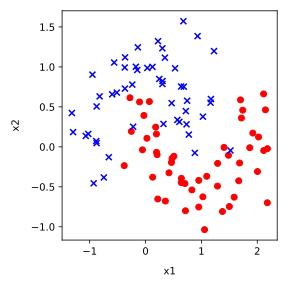
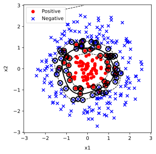
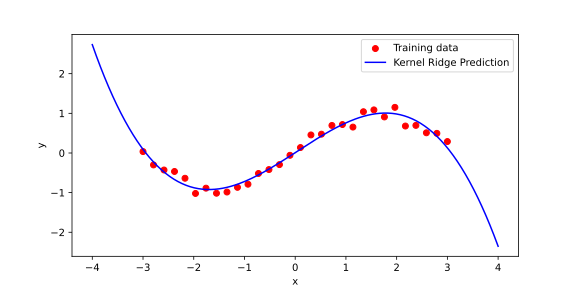

# Kernel Methods

Many machine learning models, such as linear classifiers, regressors, even data projections and clustering, work well when the data can be modelled with a straight line or a hyperplane. However, real-world data is often non-linear and not linearly separable. A common strategy to address this is to map the data into a higher-dimensional space where a linear separator may exist. Explicitly computing this transformation can be expensive or infeasible, especially in very high-dimensional spaces, and it may require a lot of memory, particularly when the original data set already contains many features.

A number of machine learning models can be expressed in terms of inner products between data instance vectors, measuring, in a way, a similarity between the data instances. Instead of expanding the vectors into a higher-dimensional feature space and computing inner products there, kernel methods introduce a trick: they use a kernel function that operates in the original input space but computes the inner product as if the data were transformed into the higher-dimensional space. This avoids the need for explicit expansion and reduces computational and memory costs.

SVMs are a natural starting point for understanding kernel methods, but they are just one example of methods that can benefit from kernels. In this lesson, we will see how the same trick applies to other machine learning methods as well. To build this understanding, we begin with the linear SVM.

## Linear SVM: Primal Form

We start with a binary classification problem. Given training examples \( (x_i, y_i) \), where \( x_i \in \mathbb{R}^d \) and \( y_i \in \{-1, 1\} \), we want to find a hyperplane that separates the two classes.

A hyperplane in \( \mathbb{R}^d \) is defined by a weight vector \( w \) and a bias term \( b \). The decision function is:

\[
f(x) = w^\top x + b
\]

A point \( x \) is classified as positive if \( f(x) > 0 \) and negative if \( f(x) < 0 \).

The **primal form** is the original formulation of the optimization problem where we directly solve for \( w \) and \( b \). The goal is to find the hyperplane that not only separates the data but does so with the **largest possible margin**. We call this the **maximum-margin classifier** because we are maximizing the distance between the hyperplane and the closest data points from each class. A larger margin tends to improve generalization.

To simplify the math, we scale \( w \) and \( b \) so that for the support vectors (the closest points), the margin is exactly 1. This leads to the following constraints:

\[
y_i (w^\top x_i + b) \geq 1 \quad \text{for all } i
\]

The equation of the hyperplane is \( w^\top x + b = 0 \). The distance \( d \) from a point \( x \) to the hyperplane is given by:

\[
d = \frac{|w^\top x + b|}{\|w\|}
\]

For the support vectors, which are the points closest to the hyperplane, the constraint \( y_i (w^\top x_i + b) = 1 \) holds. Substituting into the distance formula, the margin \( \gamma \) is:

\[
\gamma = \frac{1}{\|w\|}
\]

Thus, maximizing the margin is the same as minimizing \( \|w\| \). For mathematical convenience, we minimize \( \frac{1}{2} \|w\|^2 \) instead of \( \|w\| \) directly, because it simplifies the derivatives in the optimization. 

Therefore, the optimization problem becomes:

\[
\min_{w, b} \quad \frac{1}{2} \|w\|^2
\]
subject to:
\[
y_i (w^\top x_i + b) \geq 1 \quad \text{for all } i
\]

This is known as the **hard-margin SVM**, which assumes that the data is perfectly linearly separable. That means there exists at least one hyperplane that separates all positive and negative examples without error.

This assumption is often unrealistic in practice. Real-world data is noisy and may not be perfectly separable. In such cases, we use the soft-margin SVM, which allows some violations of the margin constraints by introducing slack variables. Soft-margin SVMs are more flexible and applicable to a wider range of data.

However, in this section, we focus on the hard-margin case because it allows us to introduce the key mathematical ideas behind SVMs more clearly. Most importantly, the dual form of the hard-margin SVM is simpler and provides the foundation for understanding how kernel methods work. The kernel trick is applied in the dual, and introducing it in the hard-margin setting avoids additional complications. We will not cover soft-margin SVMs in detail here, but the kernelization approach we develop extends naturally to that setting as well.

## Deriving the Dual Form

To solve the support vector machine optimization problem, we start with the primal form:

\[
\min_{w, b} \quad \frac{1}{2} \|w\|^2
\]
subject to:
\[
y_i (w^\top x_i + b) \geq 1 \quad \text{for all } i
\]

This is a constrained optimization problem, meaning we want to minimize an objective function while satisfying certain conditions on the variables. To handle the constraints systematically, we introduce Lagrange multipliers \( \alpha_i \geq 0 \) for each constraint. Lagrange multipliers allow us to combine the objective function and the constraints into a single expression called the Lagrangian. By doing so, we transform the constrained optimization problem into an unconstrained one, where we can apply calculus techniques to find optimal solutions. The multipliers \( \alpha_i \) can be interpreted as forces that push against the constraints, helping us balance minimizing the objective with satisfying the conditions. Our Lagrangian is:

\[
L(w, b, \alpha) = \frac{1}{2} \|w\|^2 - \sum_i \alpha_i [y_i (w^\top x_i + b) - 1]
\]

The idea is to minimize \( L \) with respect to the primal variables \( w \) and \( b \), and maximize it with respect to the dual variables \( \alpha_i \). To find the dual, we first compute the partial derivatives of \( L \) with respect to \( w \) and \( b \) and set them to zero:

\[
\frac{\partial L}{\partial w} = w - \sum_i \alpha_i y_i x_i = 0 \quad \Rightarrow \quad w = \sum_i \alpha_i y_i x_i
\]
\[
\frac{\partial L}{\partial b} = -\sum_i \alpha_i y_i = 0
\]

Substituting \( w = \sum_i \alpha_i y_i x_i \) and using \( \sum_i \alpha_i y_i = 0 \) (so \( \sum_i \alpha_i y_i b = b \sum_i \alpha_i y_i = 0 \)), we obtain

\[
\frac{1}{2} \|w\|^2 = \frac{1}{2} \left( \sum_i \alpha_i y_i x_i \right)^\top \left( \sum_j \alpha_j y_j x_j \right) = \frac{1}{2} \sum_{i,j} \alpha_i \alpha_j y_i y_j x_i^\top x_j.
\]

and

\[ -\sum_i \alpha_i [y_i (w^\top x_i + b) - 1] = - \sum_i \alpha_i (y_i w^\top x_i + y_i b - 1) = - \sum_i \alpha_i (y_i w^\top x_i - 1)
\]
because \( y_i b \) sums to 0. Expanding:
\[
= - \sum_i \alpha_i y_i w^\top x_i + \sum_i \alpha_i.
\]

But \( w = \sum_j \alpha_j y_j x_j \), so:
\[
w^\top x_i = \left( \sum_j \alpha_j y_j x_j \right)^\top x_i = \sum_j \alpha_j y_j x_j^\top x_i,
\]
thus:
\[
\sum_i \alpha_i y_i w^\top x_i = \sum_i \alpha_i y_i \sum_j \alpha_j y_j x_j^\top x_i = \sum_{i,j} \alpha_i \alpha_j y_i y_j x_i^\top x_j.
\]

Putting it together, the first term is \( \frac{1}{2} \sum_{i,j} \alpha_i \alpha_j y_i y_j x_i^\top x_j \), and the second term is \( - \sum_{i,j} \alpha_i \alpha_j y_i y_j x_i^\top x_j + \sum_i \alpha_i \). Thus, the dual becomes:
\[
\max_{\alpha}L(\alpha) = \sum_i \alpha_i - \frac{1}{2} \sum_{i,j} \alpha_i \alpha_j y_i y_j x_i^\top x_j
\]

subject to:
\[
\alpha_i \geq 0, \quad \sum_i \alpha_i y_i = 0
\]

In the dual problem, the optimization depends only on the dot products \( x_i^\top x_j \) between pairs of training examples. To simplify both the notation and the computation, we introduce the **Gram matrix** \( K \), defined by \( K_{ij} = x_i^\top x_j \). The Gram matrix collects all pairwise dot products between training points into a single matrix. It is called a "Gram matrix" because, in linear algebra, such a matrix arises when computing all inner products between a set of vectors, and its properties reflect the geometric relationships—such as angles and lengths—between those vectors. In particular, **the Gram matrix is always symmetric and positive semi-definite**, properties that are crucial for the convexity and solvability of the dual optimization problem.

The dual form is crucial because it reveals important properties of the solution and simplifies further developments. In the dual, the data points appear only through dot products \( x_i^\top x_j \), which will later allow us to introduce kernels and extend SVMs to non-linear decision boundaries. 

Moreover, solving the dual often results in sparse solutions: most of the \( \alpha_i \) will be zero, and only a small subset of points with \( \alpha_i > 0 \) — the support vectors — will define the decision boundary.

Once we solve for the optimal multipliers \( \alpha_i \), we can reconstruct the weight vector as:

\[
w = \sum_i \alpha_i y_i x_i
\]

The bias term \( b \) can be computed using any support vector. For a support vector \( (x_s, y_s) \), we have

\[
y_s (w^\top x_s + b) = 1,
\]

which rearranges to

\[
b = y_s - \sum_i \alpha_i y_i x_i^\top x_s.
\]

In practice, it is common to compute \( b \) for each support vector and take the average:

\[
b = \frac{1}{|\mathcal{S}|} \sum_{s \in \mathcal{S}} \left( y_s - \sum_i \alpha_i y_i x_i^\top x_s \right),
\]

where \( \mathcal{S} \) denotes the set of support vectors.


The decision function for classifying new points is:

\[
f(x) = \sum_i \alpha_i y_i x_i^\top x + b
\]

and the class for the data instance \( x \) is \( \operatorname{sign}(f(x)) \). This compact representation shows that only the support vectors are needed for predictions (!), making the model efficient in both computation and memory. In other words, essentially, we do not need to compute \( w \) and bias (although, as shown above, we can).

## Linear SVM and Quadratic Programming: An Example in Python

We have seen that solving the dual form of a support vector machine leads naturally to a quadratic programming problem. Let us now recall the objective and show how it can be solved in practice.

The dual form of the hard-margin SVM optimization problem is:

\[
\max_\alpha \sum_i \alpha_i - \frac{1}{2} \sum_{i,j} \alpha_i \alpha_j y_i y_j x_i^\top x_j
\]
subject to:

\[
\alpha_i \geq 0, \quad \sum_i \alpha_i y_i = 0
\]

The variables \( \alpha_i \) are the Lagrange multipliers associated with each training example.  
Only a few \( \alpha_i \) will be nonzero at the solution, corresponding to the support vectors.

To solve this problem with a quadratic programming solver like `cvxopt`, we need to express it in the standard form:

\[
\min_x \quad \frac{1}{2} x^\top P x + q^\top x
\]
subject to:

\[
Gx \leq h, \quad Ax = b
\]

where the matrices are defined as follows:

- \( P_{ij} = y_i y_j x_i^\top x_j \)
- \( q_i = -1 \) for all \( i \)
- \( G = -I \) and \( h = 0 \), enforcing \( \alpha_i \geq 0 \)
- \( A \) is a row vector of \( y_i \) values
- \( b = 0 \), enforcing \( \sum_i \alpha_i y_i = 0 \)

We now demonstrate how to solve this problem with synthetic linearly separable data in Python.

First, we generate a simple 2D dataset:

```python
import numpy as np
import matplotlib.pyplot as plt
from cvxopt import matrix, solvers

# Generate synthetic data
np.random.seed(0)
num_samples = 20
X_pos = np.random.randn(num_samples, 2) + np.array([2, 2])
X_neg = np.random.randn(num_samples, 2) + np.array([-2, -2])
X = np.vstack((X_pos, X_neg))
y = np.hstack((np.ones(num_samples), -np.ones(num_samples)))
```

Next, we set up the matrices for the quadratic program:

```python
# Compute the Gram matrix
K = np.dot(X, X.T)
P = matrix(np.outer(y, y) * K)
q = matrix(-np.ones(2 * num_samples))
G = matrix(-np.eye(2 * num_samples))
h = matrix(np.zeros(2 * num_samples))
A = matrix(y, (1, 2 * num_samples), 'd')
b = matrix(0.0)
```

We solve the quadratic program:

```python
solution = solvers.qp(P, q, G, h, A, b)
alphas = np.array(solution['x']).flatten()
```

Now, primarily for plotting of our model, we can now find the weight vector \( w \) and bias \( b \).

```python
# Reconstruct w
w = np.sum(alphas[:, None] * y[:, None] * X, axis=0)

# Identify support vectors
support_vectors = alphas > 1e-5

# Compute b using any support vector
b_value = np.mean(y[support_vectors] - np.dot(X[support_vectors], w))
```

Since our data lies in two-dimensions, we can now plot it, together with the decision boundary and the support vectors, that is, the data items which lie on the decision margins:


**Figure:** Decision boundary and support vectors for a linear SVM trained via quadratic programming; support vectors are highlighted with larger markers.

Note that for classifying the new data we would not compute the feature weights and the intercept. Instead, Once the optimal \( \alpha_i \) are found, we can classify a new point \( x \) by evaluating the decision function

\[
f(x) = \sum_i \alpha_i y_i K(x_i, x) + b,
\]

where the sum runs over all support vectors (those points with \( \alpha_i > 0 \)). This will especially come handy in the sections that follows, once we move from linear decision boundaries.

In this example, we see how solving the SVM dual problem results in a sparse set of support vectors, which define the decision boundary. The data points corresponding to nonzero \( \alpha_i \) are exactly those lying on the margin, and they are highlighted in the plot.  
This simple demonstration shows both the practical use of quadratic programming and the intuitive structure of the SVM solution.

## Soft Margin Linear SVM

In practice, real-world data is often noisy or overlapping, and perfect linear separability is not possible. If we apply a hard-margin SVM to such data, the optimization problem may have no solution at all. To handle this, the soft-margin SVM was introduced, allowing some points to violate the margin constraints while still aiming to find a hyperplane that separates the data as well as possible.

The idea is to introduce slack variables \( \xi_i \geq 0 \) that measure how much each point violates the margin. The primal optimization problem for the soft-margin SVM becomes:

\[
\min_{w, b, \xi} \quad \frac{1}{2} \|w\|^2 + C \sum_i \xi_i
\]
subject to:

\[
y_i (w^\top x_i + b) \geq 1 - \xi_i, \quad \xi_i \geq 0 \quad \text{for all } i
\]

Here, \( C > 0 \) is a regularization parameter that controls the trade-off between maximizing the margin and minimizing the total amount of margin violation.

In the dual form, the only change compared to the hard-margin case is in the inequality constraint on \( \alpha_i \). While for the hard-margin case we required only \( \alpha_i \geq 0 \), the soft-margin dual constraints become:

\[
0 \leq \alpha_i \leq C
\]

This means that now each \( \alpha_i \) is bounded above by \( C \). Let us describe how we came to this constraint. In the hard-margin SVM, we required that the training points be separated perfectly. This led to constraints \( y_i (w^\top x_i + b) \geq 1 \) for all \( i \), and in the dual, the condition on the Lagrange multipliers was simply \( \alpha_i \geq 0 \).

In the soft-margin SVM, we allow violations of the margin by introducing slack variables \( \xi_i \geq 0 \), and the constraint becomes:

\[
y_i (w^\top x_i + b) \geq 1 - \xi_i
\]

To penalize violations, the primal objective function adds a term \( C \sum_i \xi_i \), where \( C > 0 \) controls the strength of the penalty.  

When we set up the Lagrangian for this problem, we introduce:
- \( \alpha_i \geq 0 \) for the margin constraint,
- \( \mu_i \geq 0 \) for the slack variable constraint \( \xi_i \geq 0 \).

The full Lagrangian becomes:

\[
L(w, b, \xi, \alpha, \mu) = \frac{1}{2} \|w\|^2 + C \sum_i \xi_i - \sum_i \alpha_i [y_i(w^\top x_i + b) - 1 + \xi_i] - \sum_i \mu_i \xi_i
\]

Now, take the derivative of \( L \) with respect to \( \xi_i \) and set it to zero:

\[
\frac{\partial L}{\partial \xi_i} = C - \alpha_i - \mu_i = 0
\]

Since \( \mu_i \geq 0 \) and from this equation \( \alpha_i + \mu_i = C \), it follows that:

\[
\alpha_i \leq C
\]

Thus, each \( \alpha_i \) must satisfy both \( \alpha_i \geq 0 \) and \( \alpha_i \leq C \), which together gives:

\[
0 \leq \alpha_i \leq C
\]

This is how the constraint in the dual form changes from the hard-margin to the soft-margin SVM. The upper bound \( C \) appears because we explicitly allow controlled margin violations in the primal. In the soft-margin case, the upper bound \( C \) controls how much violation of the margin is tolerated. If \( \alpha_i = 0 \), the corresponding point lies outside the margin and is correctly classified. If \( 0 < \alpha_i < C \), the point lies exactly on the margin boundary and is a support vector. If \( \alpha_i = C \), the point is either inside the margin or misclassified. Therefore, the condition \( 0 \leq \alpha_i \leq C \) reflects the balance between fitting the data and allowing margin violations when necessary.

Therefore, to modify the code for the soft-margin SVM, we only need to change the matrix \( G \) and the vector \( h \) to reflect both lower and upper bounds:

```python
# For soft-margin SVM: enforce 0 <= alpha_i <= C
C_value = 1.0  # Example value of C

# Stack two constraints: -alpha <= 0 and alpha <= C
G = matrix(np.vstack((-np.eye(2 * num_samples), np.eye(2 * num_samples))))
h = matrix(np.hstack((np.zeros(2 * num_samples), C_value * np.ones(2 * num_samples))))
```

All other parts of the code remain exactly the same. By adjusting the value of \( C \), we can control how strictly we penalize margin violations: large values of \( C \) make the SVM behave like a hard-margin SVM, while smaller values allow for more flexibility and better handling of noisy data. A typical value of \( C \) is between 0.1 and 100, depending on the scale and noise of the data.  

- If \( C \) is large (e.g., \( C = 1000 \)), the SVM will strongly penalize misclassifications, behaving almost like a hard-margin SVM.
- If \( C \) is small (e.g., \( C = 0.1 \)), the SVM will allow more violations, leading to a wider margin that tolerates some errors.

In practice, \( C \) is often selected using internal cross-validation to find the value that gives the best generalization on unseen data.

We used the above code, changed the data slightly to introduce overlap of classes, and obtain the following solution:


## Beyond Linearity in SVM: The Kernel Trick

So far, we have seen how a linear SVM can find a separating hyperplane for linearly separable or almost linearly separable data. However, many real-world datasets are not linearly separable in the original input space. To illustrate this, let us consider a simple example: the "moons" dataset, a classic toy dataset where two classes form crescent shapes. This data cannot be separated by any straight line.

```python
from sklearn.datasets import make_moons

# Generate non-linearly separable data
X, y = make_moons(n_samples=100, noise=0.1, random_state=0)
y = 2 * y - 1  # Convert labels from {0,1} to {-1,1}
```


**Figure:** Two-dimensional data with non-linear classification boundary and overlap between the two classes.

If we attempt to apply a linear SVM to this dataset, the results will be poor, as no linear hyperplane can effectively separate the two classes. This motivates the use of kernels, which offer a powerful way to extend linear models to non-linear settings.

The key observation is that in the dual formulation of the SVM, the data appears only through dot products \( x_i^\top x_j \). The kernel trick is the idea that we can replace these dot products with a kernel function \( K(x_i, x_j) \), where the function computes the inner product between \( \phi(x_i) \) and \( \phi(x_j) \) in some higher-dimensional feature space. Crucially, we do not need to compute the mapping \( \phi(x) \) explicitly. We only need a kernel function that gives the correct inner product in the transformed space.

Since the dual SVM depends only on dot products, replacing them with a kernel function modifies the decision function accordingly. In the kernelized SVM, the **decision function** used to classify a new point \( x \) becomes:

\[
f(x) = \sum_i \alpha_i y_i K(x_i, x) + b
\]

where the sum runs over all support vectors (the points with \( \alpha_i > 0 \)). This form shows how the kernel allows us to operate in a high-dimensional feature space without ever explicitly computing the mapping.

One intuitive and simple choice of kernel is the polynomial kernel, defined by

\[
K(x, x') = (x^\top x' + c)^d,
\]

where \( d \) is the degree of the polynomial and \( c \) is a constant controlling the influence of higher-order terms. In our implementation, using a kernel instead of the plain dot product requires only a small change: when computing the Gram matrix, instead of using \( K_{ij} = x_i^\top x_j \), we compute \( K(x_i, x_j) \) using the chosen kernel function.

For the polynomial kernel, the Gram matrix is computed as:

```python
# Polynomial kernel function
def polynomial_kernel(X, degree=3, coef0=1):
    return (np.dot(X, X.T) + coef0) ** degree

# Compute the kernel matrix
K = polynomial_kernel(X, degree=3, coef0=1)
P = matrix(np.outer(y, y) * K)
```

For implementation of SVM, all the other parts of the code—setting up \( q \), \( G \), \( h \), \( A \), \( b \), solving the quadratic program, and identifying support vectors—remain exactly the same as before. The only difference lies in how we compute the inner products between data points: instead of using the standard dot product, we replace it with the value given by the chosen kernel function.

The followig figure shows the result of our procedure.


**Figure:** Decision boundary and margins for SVM with polynomial kernel with degree 3. To plot this figure, a dense grid of points is generated across the feature space, and the decision function is evaluated at each point. The decision boundary and margins are drawn as contour lines corresponding to \( f(x) = 0 \) (the boundary) and \( f(x) = \pm 1 \) (the margins). The support vectors are highlighted with larger circles to emphasize the points that define the structure of the classifier.

By applying the kernel trick, we can now find flexible, non-linear decision boundaries in the original input space. This enables SVMs to handle complex data patterns without changing the core structure of the algorithm.

Intuitively, the kernel function acts as a measure of similarity between two data points, but not in the original input space. Instead, it measures how similar the points are after an implicit mapping into a higher-dimensional feature space. Two points \( x \) and \( x' \) are considered similar if \( K(x, x') \) is large, and dissimilar if \( K(x, x') \) is small. In the case of the standard linear kernel, this similarity reduces to the ordinary dot product \( x^\top x' \). With more complex kernels, such as the polynomial kernel

\[
K(x, x') = (x^\top x' + c)^d,
\]

the notion of similarity becomes richer, capturing not just the direct alignment of two vectors, but also higher-order interactions between their components.

This interpretation helps explain how the SVM can separate non-linearly distributed classes. Instead of relying on the geometric arrangement of points in the original input space, it relies on the similarities encoded by the kernel function. The optimization problem then seeks a decision boundary that separates points that are similar in one way from points that are similar in another, according to the kernel-induced geometry.

## Why Calling It a Trick?

The term "kernel trick" is used because it allows us to achieve a powerful transformation without explicitly performing any complicated or costly computations. In principle, mapping the data points \( x \) into a high-dimensional or even infinite-dimensional feature space via a function \( \phi(x) \) could be computationally infeasible. However, by using a kernel function \( K(x, x') \), we can compute the inner products between transformed points directly, without ever constructing \( \phi(x) \) itself.

The "trick" is that the algorithm operates as if it were working in a high-dimensional space, benefiting from the increased expressive power, while remaining computationally efficient and mathematically simple. The structure of the SVM optimization problem does not change; only the way we compute similarities between data points is modified through the kernel function. This elegant shortcut is what gives the kernel trick its name.

## Common Kernels

Once we understand the kernel trick, it is natural to ask which kernel function we should choose for a particular problem. Several kernels have become standard tools, each suited to different types of data and problem settings.

The **linear kernel** is the simplest kernel, given by

\[
K(x, x') = x^\top x'.
\]

It corresponds to the standard dot product in the original space and leads to a linear decision boundary. It is a good choice when the data is already approximately linearly separable or when the number of features is very large compared to the number of samples.

The **polynomial kernel** is given by

$$
K(x, x') = (x^\top x' + c)^d,
$$

where $c$ and $d$ are parameters. It allows the model to capture interactions between features up to a specified degree. Lower-degree polynomials capture simple interactions, while higher degrees allow more complex decision boundaries, at the cost of higher risk of overfitting. Typical values of the parameters are $d = 2$ or $d = 3$, corresponding to quadratic or cubic decision boundaries that capture moderate nonlinearity without overfitting. The constant $c$ is usually set to $0$ or $1$, with $c = 1$ being a common default to ensure that the kernel output remains positive even when the dot product between inputs is small or negative. Higher degrees or larger $c$ values are rarely used, as they tend to increase model complexity and the risk of overfitting, especially with limited data.

To better understand what this kernel does, it's useful to look at the *explicit feature mapping* that corresponds to the kernel. Although the main appeal of the kernel trick is that we avoid working directly in the high-dimensional feature space, exploring this space can help build intuition about how the kernel transforms the data. Consider the case where inputs are two-dimensional vectors, $x = (x_1, x_2)$, and we use a degree-2 polynomial kernel with $c = 1$:

$$
K(x, z) = (x^\top z + 1)^2.
$$

Expanding this expression gives:

$$
(x_1 z_1 + x_2 z_2 + 1)^2 = x_1^2 z_1^2 + 2x_1 x_2 z_1 z_2 + x_2^2 z_2^2 + 2x_1 z_1 + 2x_2 z_2 + 1.
$$

This corresponds exactly to the dot product in a six-dimensional space with the following feature map:

$$
\phi(x_1, x_2) = \left( x_1^2, \sqrt{2} x_1 x_2, x_2^2, \sqrt{2} x_1, \sqrt{2} x_2, 1 \right).
$$

The $\sqrt{2}$ coefficients are included to ensure that inner products between transformed vectors match the kernel expansion exactly, preserving distances and angles. The feature map contains all monomials of degree up to 2, including cross-terms and linear terms, which explains how the polynomial kernel captures feature interactions. While this mapping is tractable for small inputs and low-degree kernels, it becomes infeasible to compute explicitly in higher dimensions—hence the power of the kernel trick, which allows us to work with such feature spaces implicitly.


The **radial basis function (RBF) kernel**, also called the Gaussian kernel, is given by

\[
K(x, x') = \exp\left(-\gamma \|x - x'\|^2\right),
\]

where \( \gamma > 0 \) controls the width of the Gaussian. The RBF kernel is extremely flexible and can model very complex boundaries. It is often the default choice when there is no strong prior knowledge about the structure of the data.

Here is an implementation of the RBF kernel, and an example of its decision boundaries and margins on an example two-dimensional data:

```python
def rbf_kernel(X1, X2=None, gamma=1.0):
    if X2 is None:
        X2 = X1
    # Compute pairwise squared distances
    X1_sq = np.sum(X1**2, axis=1)
    X2_sq = np.sum(X2**2, axis=1)
    distances = X1_sq[:, np.newaxis] + X2_sq[np.newaxis, :] - 2 * np.dot(X1, X2.T)
    return np.exp(-gamma * distances)
```



The **sigmoid kernel** is given by

\[
K(x, x') = \tanh(\alpha x^\top x' + c),
\]

where \( \alpha \) and \( c \) are parameters. It is inspired by the behavior of neurons in neural networks. However, it is less commonly used than the linear, polynomial, or RBF kernels.

## Why the RBF Kernel Is Infinite-Dimensional?

The RBF kernel has a special property: it implicitly maps data into an infinite-dimensional feature space. We can see this by expanding the RBF kernel using a Taylor series. The exponential function can be expanded as:

\[
\exp(z) = \sum_{k=0}^{\infty} \frac{z^k}{k!}.
\]

Substituting \( z = -\gamma \|x - x'\|^2 \), we get:

\[
\exp\left(-\gamma \|x - x'\|^2\right) = \sum_{k=0}^{\infty} \frac{(-\gamma \|x - x'\|^2)^k}{k!}.
\]

Each term in the expansion involves powers of the distance \( \|x - x'\|^2 \), which itself involves terms like \( (x_i - x_i')^2 \). Expanding these powers generates increasingly complex combinations of the input features.

Thus, the RBF kernel corresponds to an implicit mapping where all polynomial interactions of all degrees between the features are represented. The feature space is infinite-dimensional because the Taylor series has infinitely many terms. This property makes the RBF kernel extremely powerful: it can approximate very complex functions. However, it also increases the risk of overfitting if the hyperparameter \( \gamma \) is not chosen carefully.

## Kernels and Hilbert Spaces

When working with kernels, we are implicitly working in mathematical spaces called Hilbert spaces. A Hilbert space is a complete, infinite-dimensional generalization of Euclidean space, equipped with an inner product that satisfies certain properties. Kernels must be symmetric and positive semi-definite to correspond to valid inner products in a Hilbert space. This guarantees that the optimization problems remain convex and that the methods are mathematically well-behaved.

Although we rarely need to work directly with Hilbert spaces when applying kernel methods, understanding that kernels operate within such spaces helps explain their great flexibility and theoretical foundations. It also clarifies why we can work with infinite-dimensional feature mappings without computational problems: everything is handled through the kernel function.

## What Makes a Function a Valid Kernel?

Not every function can be used as a kernel. For a function \( K(x, x') \) to serve as a kernel, it must behave like a dot product in some (possibly high-dimensional) feature space. This ensures that all the mathematical properties that kernel methods rely on—especially the convexity of the optimization problem—are preserved.

Two key properties must hold for a function to be a valid kernel. First, the kernel must be **symmetric**, meaning

\[
K(x, x') = K(x', x)
\]

for all inputs \( x \) and \( x' \). This reflects the fact that the dot product is symmetric: the similarity between \( x \) and \( x' \) should be the same as the similarity between \( x' \) and \( x \).

Second, the kernel must be **positive semi-definite (PSD)**. This means that for any finite set of data points \( \{x_1, \ldots, x_n\} \), the corresponding Gram matrix \( K \) defined by \( K_{ij} = K(x_i, x_j) \) must satisfy:

\[
\sum_{i,j} c_i c_j K(x_i, x_j) \geq 0
\]

for all vectors \( c \in \mathbb{R}^n \). Positive semi-definiteness ensures that the optimization problem remains convex and that the SVM (or any other kernel method) has a unique, well-behaved solution.

These conditions are not merely technical. In practice, they guarantee that the kernel actually corresponds to an inner product in some feature space, even if we never compute that space explicitly. Without these properties, the optimization problem could be ill-posed, lead to unpredictable behavior, or fail entirely.

When building kernel-based models, it is important to use known valid kernels, such as the linear, polynomial, RBF, or sigmoid kernels, whose mathematical properties have been established. If you define a new kernel, you must ensure that it satisfies symmetry and positive semi-definiteness. One practical approach is to compute the Gram matrix on a few random datasets and check if it is always PSD (for example, by checking if all eigenvalues are non-negative).

Fortunately, there are simple rules for constructing new kernels. If \( K_1 \) and \( K_2 \) are valid kernels, then so are:

- \( a K_1 + b K_2 \) for any \( a, b \geq 0 \),
- \( K_1 \cdot K_2 \) (elementwise product),
- compositions such as \( f(K_1(x,x')) \) where \( f \) is a function preserving PSD.

These rules make it easy to build complex kernels by combining simpler ones, providing great flexibility while preserving the mathematical guarantees that kernel methods rely on.

## Kernel Ridge Regression

In the previous chapter, we have seen how kernels allow us to replace dot products with more flexible measures of similarity, enabling linear algorithms to operate in rich, often infinite-dimensional feature spaces. In this section, we extend another classic linear model—ridge regression—into the kernelized setting. Ridge regression is one of the simplest and most widely used techniques for fitting a function to data while controlling overfitting through regularization. Kernel ridge regression combines the strengths of ridge regression with the flexibility of kernels, resulting in a powerful tool that can model highly nonlinear patterns while remaining mathematically elegant and computationally tractable.

Let us first briefly recall the idea of standard ridge regression. Suppose we are given training data \( (x_i, y_i) \) for \( i = 1, \dots, n \), where \( x_i \in \mathbb{R}^d \) and \( y_i \in \mathbb{R} \). In linear regression, we seek a weight vector \( w \in \mathbb{R}^d \) such that the predicted value \( \hat{y}_i = w^\top x_i \) is as close as possible to the true target \( y_i \). The simplest approach minimizes the sum of squared errors:

\[
\min_w \sum_{i=1}^n (y_i - w^\top x_i)^2.
\]

However, when the number of features is large compared to the number of data points, or when the features are highly correlated, this least squares problem can lead to overfitting or unstable solutions. Ridge regression addresses this by adding a penalty on the size of the weight vector, leading to the optimization problem:

\[
\min_w \sum_{i=1}^n (y_i - w^\top x_i)^2 + \lambda \|w\|^2,
\]

where \( \lambda > 0 \) is a regularization parameter that controls the trade-off between fitting the data and keeping \( w \) small. The closed-form solution for \( w \) is well known and given by:

\[
w = (X^\top X + \lambda I)^{-1} X^\top y,
\]

where \( X \) is the \( n \times d \) matrix whose rows are the \( x_i^\top \), and \( y \) is the vector of targets.

While ridge regression is effective when the relationship between \( x \) and \( y \) is close to linear, it struggles with complex, nonlinear patterns. To address this, we could try to manually design nonlinear features, but a far more systematic approach is to use kernels. Instead of fitting a linear model in the original input space, we will fit a linear model in a high-dimensional feature space where the inputs have been transformed via a (possibly implicit) mapping \( \phi(x) \).

In the kernelized setting, we no longer seek a weight vector \( w \) directly. Instead, by the Representer Theorem, we know that the solution can be expressed as a linear combination of the training examples mapped into feature space:

\[
w = \sum_{i=1}^n \alpha_i \phi(x_i),
\]

where \( \alpha_i \) are coefficients to be determined. Thus, the predicted output for a new point \( x \) becomes:

\[
f(x) = w^\top \phi(x) = \sum_{i=1}^n \alpha_i \langle \phi(x_i), \phi(x) \rangle = \sum_{i=1}^n \alpha_i K(x_i, x),
\]

where \( K(x_i, x) \) is the kernel function that computes the inner product between \( \phi(x_i) \) and \( \phi(x) \). Thus, even though the feature space might be infinite-dimensional, the solution depends only on the finite set of training points, and all computations can be carried out via the kernel function without explicitly constructing the feature mapping.

Our goal is now to determine the coefficients \( \alpha = (\alpha_1, \dots, \alpha_n)^\top \). To find them, we substitute this form into the ridge regression objective. The empirical error term becomes:

\[
\sum_{i=1}^n (y_i - f(x_i))^2 = \sum_{i=1}^n \left(y_i - \sum_{j=1}^n \alpha_j K(x_j, x_i)\right)^2.
\]

The regularization term, originally \( \|w\|^2 \), now becomes:

\[
\|w\|^2 = \left\|\sum_{i=1}^n \alpha_i \phi(x_i)\right\|^2 = \sum_{i,j} \alpha_i \alpha_j \langle \phi(x_i), \phi(x_j) \rangle = \sum_{i,j} \alpha_i \alpha_j K(x_i, x_j).
\]

Thus, the kernel ridge regression objective is:

\[
\min_\alpha \sum_{i=1}^n \left(y_i - \sum_{j=1}^n \alpha_j K(x_j, x_i)\right)^2 + \lambda \sum_{i,j} \alpha_i \alpha_j K(x_i, x_j).
\]

This expression can be written more compactly in matrix notation. Let \( K \) denote the \( n \times n \) Gram matrix with entries \( K_{ij} = K(x_i, x_j) \). Let \( y \) and \( \alpha \) be the column vectors of the targets and coefficients, respectively. Then, the objective becomes:

\[
\min_\alpha (y - K \alpha)^\top (y - K \alpha) + \lambda \alpha^\top K \alpha.
\]

Expanding the terms, we have:

\[
(y - K\alpha)^\top (y - K\alpha) = y^\top y - 2\alpha^\top K y + \alpha^\top K^\top K \alpha,
\]

and thus the full objective is:

\[
y^\top y - 2\alpha^\top K y + \alpha^\top (K^2 + \lambda K) \alpha.
\]

To minimize with respect to \( \alpha \), we take the derivative and set it to zero:

\[
-2Ky + 2(K^2 + \lambda K)\alpha = 0,
\]

which simplifies to:

\[
(K^2 + \lambda K)\alpha = Ky.
\]

Multiplying both sides by \( K^{-1} \) (assuming \( K \) is invertible or adding a small regularization if necessary), we obtain:

\[
(K + \lambda I)\alpha = y,
\]

and thus the closed-form solution:

\[
\alpha = (K + \lambda I)^{-1} y.
\]

This remarkably simple formula shows that, once we have the Gram matrix \( K \), solving for \( \alpha \) requires only solving a linear system, exactly as in standard ridge regression but operating in the space of kernels. Once \( \alpha \) is found, predictions on a new point \( x \) are made by evaluating:

\[
f(x) = \sum_{i=1}^n \alpha_i K(x_i, x).
\]

Kernel ridge regression thus provides a flexible and efficient way to fit nonlinear functions. It retains the computational simplicity of linear models—closed-form solution, no iterative optimization needed—while being capable of modeling highly complex relationships thanks to the choice of the kernel.

To illustrate the utility of kernel ridge regression, consider the following data set:

```python
np.random.seed(0)
X = np.linspace(-3, 3, 30)[:, None]
y = np.sin(X).ravel() + 0.1 * np.random.randn(30)
```

Obviously, the relation between input feature and a class is non-linear. We will use a Gaussian (RBF) kernel that we have already defined in the previous chapter, compute the Gram matrix, and solve for `alpha`:

```python
K = rbf_kernel(X, X, gamma=1.0)
lmbda = 0.1  # regularization strength
n = K.shape[0]
alpha = np.linalg.solve(K + lmbda * np.eye(n), y)
```

To plot a result we can create linearly-spaced input points and compute predictions:

```python
X_test = np.linspace(-4, 4, 200)[:, None]
K_test = rbf_kernel(X_test, X)
y_pred = np.dot(K_test, alpha)
```


**Figure:** Data modelling with kernel ridge regression, where we have used a RBF kernel.

Changing a kernel to polynomial, third-degree kernel, yields a smoother solution:

```python
def polynomial_kernel(X1, X2, degree=3, coef0=1):
    # Polynomial kernel
    return (np.dot(X1, X2.T) + coef0) ** degree
```


**Figure:** Data modelling with kernel ridge regression, where we have used a 3-rd degree polynomial kernel.

## Kernel Logistic Regression

We can also kernalize logistic regression. Kernalizing this model may have benefits compared to SVM, as logistic regression nicely models class probabilities and does not focus only on crisp classification. Standard logistic regression models class probability as:

\[
P(y = 1 \mid \mathbf{x}) = \sigma(\mathbf{w}^\top \mathbf{x} + b)
\]

where \(\mathbf{w}\) is a weight vector and \(\mathbf{x}\) is the input. Instead of expressing \(\mathbf{w}\) directly, we express it as a linear combination of training instances:

\[
\mathbf{w} = \sum_{i=1}^n \alpha_i \mathbf{x}_i
\]

where \(\alpha_i\) are coefficients, and \(\mathbf{x}_i\) are the training examples.

Substituting into the original logistic regression formula:

\[
\mathbf{w}^\top \mathbf{x} = \left( \sum_{i=1}^n \alpha_i \mathbf{x}_i \right)^\top \mathbf{x} = \sum_{i=1}^n \alpha_i \mathbf{x}_i^\top \mathbf{x}
\]

Thus, the model becomes:

\[
P(y = 1 \mid \mathbf{x}) = \sigma\left(\sum_{i=1}^n \alpha_i \mathbf{x}_i^\top \mathbf{x} + b\right)
\]

Finally, to **kernelize**, we replace each inner product \(\mathbf{x}_i^\top \mathbf{x}\) with a **kernel function** \(K(\mathbf{x}_i, \mathbf{x})\), giving:

\[
P(y = 1 \mid \mathbf{x}) = \sigma\left(\sum_{i=1}^n \alpha_i K(\mathbf{x}_i, \mathbf{x}) + b\right)
\]

Here is the code for kernalized logistic regression. We first define the data, introduce a kernel (we opted for a Gaussian kernel) and compute the Gram matrix:

```python
X, y = make_moons(n_samples=200, noise=0.3, random_state=42)

def rbf_kernel(X1, X2, gamma=0.5):
    dists = np.sum(X1**2, axis=1)[:, None] + np.sum(X2**2, axis=1)[None, :] - 2 * X1 @ X2.T
    return np.exp(-gamma * dists)

gamma = 0.5
K = rbf_kernel(X, X, gamma)
```

Next, we define the loss function for the logistic regression. The loss is based on the standard log likelihood for logistic regression, that is, a cross-entropy loss:

```python
def sigmoid(z):
    return 1 / (1 + np.exp(-z))

def logistic_loss(alpha):
    pred = sigmoid(K @ alpha)
    return -np.mean(y * np.log(pred + 1e-15) + (1 - y) * np.log(1 - pred + 1e-15))
```

Optimization step is next:

```python
result = minimize(logistic_loss, np.zeros(X.shape[0]), method='L-BFGS-B')
alpha = result.x
```

The result is depicted in the following graph. 


**Figure:** Kernelized logistic regression, showing the decision boundary and probability contours for the target class (in red).

## Kernel approximation techniques

Kernel methods enable learning complex relationships without explicit feature transformations, but they often suffer from high computational costs. Computing and storing the full \(n \times n\) kernel matrix becomes expensive for large datasets. To address this, several kernel approximation techniques have been developed that make kernel methods scalable. Two widely used techniques are the Nyström method and Random Fourier Features.

The Nyström method approximates the full kernel matrix by sampling a small subset of the data points. Suppose we select \(m\) representative points (with \(m \ll n\)). We compute two smaller matrices: \(K_{mm}\), the kernel matrix between the sampled points, and \(K_{nm}\), the kernel matrix between all data points and the sampled points. Each entry of \(K_{mm}\) is given by

\[
(K_{mm})_{ij} = K(\mathbf{x}_i, \mathbf{x}_j)
\]

where \(\mathbf{x}_i\) and \(\mathbf{x}_j\) are sampled points, and each entry of \(K_{nm}\) is given by

\[
(K_{nm})_{ij} = K(\mathbf{x}_i, \mathbf{x}_j)
\]

where \(\mathbf{x}_i\) is any data point and \(\mathbf{x}_j\) is a sampled point. The full kernel matrix \(K_{nn}\) is then approximated as

\[
K_{nn} \approx K_{nm} K_{mm}^{-1} K_{nm}^\top
\]

This reduces both storage and computation, enabling approximate kernel methods on much larger datasets.

Random Fourier Features approximate shift-invariant kernels, such as the RBF kernel, by mapping inputs into a randomized finite-dimensional feature space where inner products approximate the kernel. By Bochner’s theorem, a shift-invariant kernel can be expressed as the Fourier transform of a probability distribution. To construct random features, we sample random frequencies \(\omega\) from the Fourier transform of the kernel and define random features

\[
z(\mathbf{x}) = \sqrt{2} \cos(\omega^\top \mathbf{x} + b)
\]

where \(b\) is sampled uniformly from \([0, 2\pi]\). Instead of computing \(K(\mathbf{x}, \mathbf{x'})\), we now compute

\[
K(\mathbf{x}, \mathbf{x'}) \approx z(\mathbf{x})^\top z(\mathbf{x'})
\]

This technique reduces the problem to a simple linear model in the new randomized feature space.

Both the Nyström method and Random Fourier Features allow large-scale learning with kernel methods by approximating the kernel matrix or embedding the data into a lower-dimensional space. They make kernel-based algorithms practical for modern datasets without losing much of the expressive power of kernels.

### Kernel methods in text mining and bioinformatics

Kernel methods are highly flexible and can be adapted to domains where data are not naturally represented as numerical vectors. In areas such as natural language processing (NLP) and bioinformatics, kernel methods enable learning directly from structured objects like strings, sequences, or trees.

In NLP, string kernels measure similarity between two text sequences without explicit feature extraction. For example, the substring kernel counts the number of common subsequences between two strings. Given two strings \(s\) and \(t\), the kernel value is higher if they share many common subsequences, weighted by their lengths and positions. This allows classifiers such as SVMs to operate directly on text, enabling tasks like text classification, document categorization, and named entity recognition without the need for explicit vectorization.

In bioinformatics, kernel methods are used to compare biological sequences such as DNA, RNA, or proteins. A common example is the spectrum kernel, which represents sequences by their counts of all possible \(k\)-mers (substrings of length \(k\)). The spectrum kernel between two sequences \(s\) and \(t\) is defined as

\[
K(s, t) = \langle \Phi_k(s), \Phi_k(t) \rangle
\]

where \(\Phi_k(s)\) is a feature vector counting the occurrences of each possible \(k\)-mer in sequence \(s\). More advanced kernels, such as mismatch kernels and gapped substring kernels, allow for small mutations, making them well-suited to biological data where sequences may not match exactly.

In both NLP and bioinformatics, kernel methods leverage domain-specific similarity functions to apply powerful machine learning techniques directly to structured or discrete data without requiring manual feature engineering.

## Conclusion

Kernel methods offer a powerful way to model nonlinear relationships by implicitly mapping data into high-dimensional spaces where linear algorithms can operate more effectively. Their main advantage lies in enabling complex decision boundaries without explicitly computing the transformation, thanks to the kernel trick. These techniques have been foundational in the development of support vector machines and other classical machine learning models, offering strong theoretical guarantees and robust performance on small to medium-sized datasets. However, they often struggle with scalability and representation learning compared to modern deep neural networks. Today, while deep learning has largely eclipsed kernel methods in popularity—especially in areas like computer vision and natural language processing—kernels remain an important conceptual and mathematical tool, and continue to find use in specialized applications and theoretical work.
