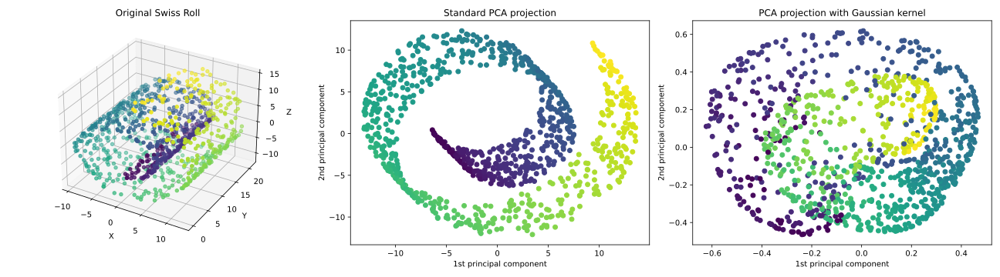

## Kernel Principal Component Analysis

Principal Component Analysis (PCA) is one of the most fundamental techniques in machine learning and data analysis. In its classical form, PCA seeks directions in the data that maximize variance. By projecting the data onto these directions, we can reduce its dimensionality while preserving as much of the original structure as possible. However, linear PCA assumes that the important patterns in the data can be captured by linear relationships. This assumption often fails when the data has a complex, non-linear structure. Imagine, for example, points distributed along a twisted "Swiss roll" in three dimensions: no straight line can fully capture the variations inherent in the data. In such cases, linear PCA can only offer a poor approximation.

Kernel PCA extends the ideas of PCA to non-linear structures by using the kernel trick. Instead of working directly with the original data, we implicitly map the data points into a high-dimensional feature space using a non-linear mapping \( \phi(x) \). In this feature space, the complex structure of the data may become simple and linear, allowing standard PCA techniques to uncover meaningful patterns. Crucially, we never need to compute \( \phi(x) \) explicitly. By using a kernel function that calculates inner products in the feature space, we perform all necessary computations efficiently without ever leaving the original input space.

To understand how Kernel PCA works, let us briefly revisit the core steps of linear PCA. Given a data matrix \( X \) with \( n \) samples, each a vector in \( \mathbb{R}^d \), PCA computes the covariance matrix \( \Sigma = \frac{1}{n} X^\top X \) and finds its eigenvectors and eigenvalues. The eigenvectors corresponding to the largest eigenvalues define the principal components: the directions of maximum variance. To project a new point onto these directions, we simply take dot products with the principal eigenvectors.

In Kernel PCA, the idea is the same, but performed in feature space. We want to find directions \( v \) in feature space that maximize the variance of the data after projection. Since the feature space might be very high-dimensional, or even infinite-dimensional, we avoid working with vectors like \( v \) directly. Instead, we seek solutions that can be expressed as linear combinations of the mapped data points, \( v = \sum_{i=1}^n \alpha_i \phi(x_i) \), a fact guaranteed by the Representer Theorem. The optimization problem then reduces to finding the coefficients \( \alpha_i \) that solve a certain eigenvalue problem involving the kernel matrix.

Mathematically, we begin by forming the kernel matrix \( K \), where each entry is \( K_{ij} = K(x_i, x_j) \). This entry represents the inner product between the mapped points \( \phi(x_i) \) and \( \phi(x_j) \) in the feature space: \( K(x_i, x_j) = \langle \phi(x_i), \phi(x_j) \rangle \). Even though we never compute \( \phi(x) \) explicitly, the kernel matrix \( K \) gives us all the information we need to work with the data in the higher-dimensional space. However, before we can perform principal component analysis, we need to make sure that the data is centered in the feature space — that is, that the mean of the mapped data points is zero. This requirement is inherited from standard PCA, where variance is always measured with respect to the mean.

In linear PCA, centering the data is easy: we simply subtract the mean vector from each data point. In kernel PCA, we cannot directly subtract means because we do not have access to the mapped points \( \phi(x_i) \). Instead, we must adjust the kernel matrix itself to behave as if the data were centered. 

To understand how centering affects the kernel matrix, suppose that the mean of the mapped data is:

\[
\bar{\phi} = \frac{1}{n} \sum_{i=1}^n \phi(x_i).
\]

The centered version of \( \phi(x_i) \) is:

\[
\phi(x_i) - \bar{\phi}.
\]

The inner product between two centered points \( \phi(x_i) - \bar{\phi} \) and \( \phi(x_j) - \bar{\phi} \) is then:

\[
\langle \phi(x_i) - \bar{\phi}, \phi(x_j) - \bar{\phi} \rangle.
\]

Expanding this expression using basic properties of the inner product gives:

\[
\langle \phi(x_i), \phi(x_j) \rangle - \langle \phi(x_i), \bar{\phi} \rangle - \langle \bar{\phi}, \phi(x_j) \rangle + \langle \bar{\phi}, \bar{\phi} \rangle.
\]

Each of these terms can be expressed in terms of the original kernel function. The first term \( \langle \phi(x_i), \phi(x_j) \rangle \) is simply \( K(x_i, x_j) \). The second term \( \langle \phi(x_i), \bar{\phi} \rangle \) is the average of \( \langle \phi(x_i), \phi(x_k) \rangle \) over all \( k \), which is:

\[
\langle \phi(x_i), \bar{\phi} \rangle = \frac{1}{n} \sum_{k=1}^n \langle \phi(x_i), \phi(x_k) \rangle = \frac{1}{n} \sum_{k=1}^n K(x_i, x_k).
\]

Similarly, the third term \( \langle \bar{\phi}, \phi(x_j) \rangle \) is:

\[
\frac{1}{n} \sum_{k=1}^n K(x_k, x_j),
\]

and the last term \( \langle \bar{\phi}, \bar{\phi} \rangle \) is the average of all pairwise kernel evaluations:

\[
\langle \bar{\phi}, \bar{\phi} \rangle = \frac{1}{n^2} \sum_{k=1}^n \sum_{l=1}^n K(x_k, x_l).
\]

Putting all this together, the centered kernel matrix \( \tilde{K} \) has entries:

\[
\tilde{K}_{ij} = K(x_i, x_j) - \frac{1}{n} \sum_{k=1}^n K(x_i, x_k) - \frac{1}{n} \sum_{k=1}^n K(x_k, x_j) + \frac{1}{n^2} \sum_{k=1}^n \sum_{l=1}^n K(x_k, x_l).
\]

This formula can be compactly written in matrix form:

\[
\tilde{K} = K - \mathbf{1}_n K - K \mathbf{1}_n + \mathbf{1}_n K \mathbf{1}_n,
\]

where \( \mathbf{1}_n \) is the \( n \times n \) matrix with all entries equal to \( \frac{1}{n} \).  
This compact form efficiently computes the centered kernel matrix without explicit loops over individual entries.

Once we have the centered kernel matrix \( \tilde{K} \), Kernel PCA proceeds exactly like linear PCA. We solve the eigenvalue problem:

\[
\tilde{K} \alpha = \lambda \alpha,
\]

where \( \lambda \) is an eigenvalue and \( \alpha \) is the corresponding eigenvector. This step mirrors what we do in linear PCA, where we compute eigenvectors of the empirical covariance matrix of the data. In Kernel PCA, however, we do not have direct access to the mapped data points \( \phi(x_i) \), so we cannot compute the covariance matrix in feature space explicitly. Instead, it can be shown that the centered kernel matrix \( \tilde{K} \) plays the role of the covariance matrix in the feature space. More precisely, \( \tilde{K} \) is proportional to the Gram matrix of centered feature vectors, and solving the eigenvalue problem on \( \tilde{K} \) allows us to find the directions of maximum variance without ever needing to compute or store the mapped features themselves. Thus, the kernel matrix effectively replaces the covariance matrix in Kernel PCA.

Finally, to project a new point \( x \) onto the \( k \)-th principal component, we need to compute the inner product between \( \phi(x) \) (the feature space mapping of \( x \)) and the corresponding principal component direction. In feature space, this principal component is expressed as:

\[
v^{(k)} = \sum_{i=1}^n \alpha_i^{(k)} \left( \phi(x_i) - \bar{\phi} \right),
\]

where \( \bar{\phi} = \frac{1}{n} \sum_{i=1}^n \phi(x_i) \) is the mean of the mapped training points.

Thus, the projection is:

\[
\text{projection} = \langle \phi(x) - \bar{\phi}, v^{(k)} \rangle.
\]

Expanding this expression:

\[
\text{projection} = \left\langle \phi(x) - \bar{\phi}, \sum_{i=1}^n \alpha_i^{(k)} (\phi(x_i) - \bar{\phi}) \right\rangle = \sum_{i=1}^n \alpha_i^{(k)} \langle \phi(x) - \bar{\phi}, \phi(x_i) - \bar{\phi} \rangle.
\]

Therefore, we need to compute inner products of the form \( \langle \phi(x) - \bar{\phi}, \phi(x_i) - \bar{\phi} \rangle \). Expanding this further:

\[
\langle \phi(x) - \bar{\phi}, \phi(x_i) - \bar{\phi} \rangle = \langle \phi(x), \phi(x_i) \rangle - \langle \phi(x), \bar{\phi} \rangle - \langle \bar{\phi}, \phi(x_i) \rangle + \langle \bar{\phi}, \bar{\phi} \rangle.
\]

Each of these terms can be expressed in terms of the kernel function:

- \( \langle \phi(x), \phi(x_i) \rangle = K(x, x_i) \),
- \( \langle \phi(x), \bar{\phi} \rangle = \frac{1}{n} \sum_{j=1}^n K(x, x_j) \),
- \( \langle \bar{\phi}, \phi(x_i) \rangle = \frac{1}{n} \sum_{j=1}^n K(x_j, x_i) \),
- \( \langle \bar{\phi}, \bar{\phi} \rangle = \frac{1}{n^2} \sum_{j,k=1}^n K(x_j, x_k) \).

Thus, the centered kernel between \( x \) and \( x_i \), denoted \( \tilde{K}(x, x_i) \), is:

\[
\tilde{K}(x, x_i) = K(x, x_i) - \frac{1}{n} \sum_{j=1}^n K(x, x_j) - \frac{1}{n} \sum_{j=1}^n K(x_j, x_i) + \frac{1}{n^2} \sum_{j,k=1}^n K(x_j, x_k).
\]

Finally, the projection of \( x \) onto the \( k \)-th principal component is:

\[
\text{projection}_k(x) = \sum_{i=1}^n \alpha_i^{(k)} \tilde{K}(x, x_i).
\]

This formula shows that to project a new point \( x \), we:

1. Compute its (uncentered) kernel similarities to all training points: \( (K(x_1, x), \ldots, K(x_n, x)) \),
2. Apply the same centering adjustments as we did for the training data,
3. Take the dot product with the corresponding eigenvector \( \alpha^{(k)} \).

This way, we can compute projections purely using kernel evaluations, without ever explicitly mapping into feature space.

In practice, Kernel PCA unlocks the ability to "unfold" complex structures that would be impossible to separate using linear techniques. A classical demonstration is applying Kernel PCA to the "Swiss roll" dataset. In the original three-dimensional space, the data is coiled like a rolled-up sheet. Applying Kernel PCA with a radial basis function (RBF) kernel maps the data into a lower-dimensional space where the intrinsic two-dimensional nature of the data becomes visible and linear. Similarly, the "two moons" dataset, with its interleaving crescent shapes, can be flattened and separated by Kernel PCA, where linear PCA would fail.

Implementing Kernel PCA is remarkably simple once the kernel matrix is constructed. We compute the kernel matrix, center it, perform eigen-decomposition, and project onto the leading eigenvectors. All heavy lifting is handled by basic linear algebra operations, and the choice of kernel function shapes how the non-linear structure is revealed. Polynomial kernels, RBF kernels, and even custom-designed kernels can be used, depending on the nature of the data.

Kernel PCA elegantly shows how the kernel trick extends beyond supervised learning. By working purely with inner products, it allows classic algorithms like PCA to operate in vastly richer spaces. The method reveals the deep idea underlying kernel methods: transforming a problem from one space where it is hard to another space where it is simple, without ever computing the transformation explicitly.

Time for an example in Python. We first generate the data, define the Kernel, and compute the Gram matrix, and center it:

```python
X, color = make_swiss_roll(n_samples=1000, noise=0.05, random_state=42)

def rbf_kernel(X, gamma=0.02):
    sq_dists = np.sum(X**2, axis=1).reshape(-1, 1) + np.sum(X**2, axis=1) - 2 * np.dot(X, X.T)
    return np.exp(-gamma * sq_dists)

K = rbf_kernel(X)

n = K.shape[0]
one_n = np.ones((n, n)) / n
K_centered = K - one_n @ K - K @ one_n + one_n @ K @ one_n
```

Next, we compute the principal components:

```python
eigenvalues, eigenvectors = np.linalg.eigh(K_centered)
idx = np.argsort(eigenvalues)[::-1]
eigenvalues = eigenvalues[idx]
eigenvectors = eigenvectors[:, idx]

# Normalize eigenvectors (important because in feature space, eigenvectors need normalization)
alphas = eigenvectors / np.sqrt(eigenvalues[np.newaxis, :])
```

Following projects the data to principal components:
```python
X_kpca = K_centered @ alphas[:, :2]
```

Following are the results. 


**Figure**: The use of a Gaussian (RBF) kernel is crucial for successfully unfolding the Swiss roll. Because the data lies on a nonlinear manifold, points that are nearby along the roll can be far apart in the ambient three-dimensional space. Linear PCA, which only captures global linear directions, fails to reveal the true structure (the points that span the Y direction are squeezed in the same space). In contrast, the Gaussian kernel captures local similarities by measuring distances in a way that respects the manifold's curvature. Kernel PCA with the RBF kernel thus successfully flattens the Swiss roll, revealing its intrinsic two-dimensional organization.

## Kernel k-Means

Kernel methods are not limited to supervised learning. We have already shown that in our example for kernel PCA. Another important example in unsupervised learning is kernel k-means, which generalizes the standard k-means clustering algorithm to allow for discovering more complex cluster shapes.

Standard k-means partitions data by assigning each point \(\mathbf{x}_i\) to the nearest cluster center \(\boldsymbol{\mu}_k\), minimizing the squared Euclidean distance:

\[
\text{assign } \mathbf{x}_i \text{ to cluster } k = \arg \min_k \|\mathbf{x}_i - \boldsymbol{\mu}_k\|^2
\]

While k-means does not require linear separation between clusters, it tends to perform well only when clusters are roughly spherical, compact, and equally sized — such as concentric or well-separated blobs. It struggles with more complex, non-convex cluster shapes.

Kernel k-means addresses this limitation by implicitly mapping the data into a higher-dimensional feature space using a mapping \(\phi(\mathbf{x})\), where more complex structures can become easier to separate. The algorithm then minimizes distances in the feature space:

\[
\text{assign } \mathbf{x}_i \text{ to cluster } k = \arg \min_k \|\phi(\mathbf{x}_i) - \boldsymbol{\mu}_k'\|^2
\]

where \(\boldsymbol{\mu}_k'\) is the mean of cluster \(k\) in the feature space.

Expanding the squared distance gives:

\[
\|\phi(\mathbf{x}_i) - \boldsymbol{\mu}_k'\|^2 = K(\mathbf{x}_i, \mathbf{x}_i) - \frac{2}{|C_k|} \sum_{\mathbf{x}_j \in C_k} K(\mathbf{x}_i, \mathbf{x}_j) + \frac{1}{|C_k|^2} \sum_{\mathbf{x}_j, \mathbf{x}_l \in C_k} K(\mathbf{x}_j, \mathbf{x}_l)
\]

where:
- \(K(\mathbf{x}_i, \mathbf{x}_j)\) is the kernel function,
- \(C_k\) is the set of points assigned to cluster \(k\),
- \(|C_k|\) is the number of points in cluster \(k\).

Thus, Kernel k-means proceeds exactly like k-means but replaces Euclidean distances with distances computed via kernels, enabling it to discover non-convex, complex cluster structures. While we will not explore the full algorithm in this lesson, mentioning Kernel k-means illustrates how the kernel trick can extend beyond classification to enable more flexible clustering as well.

